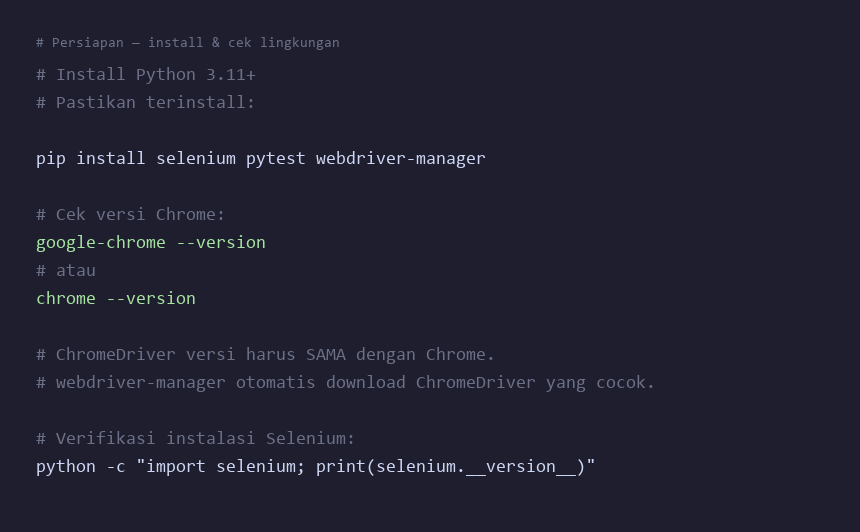
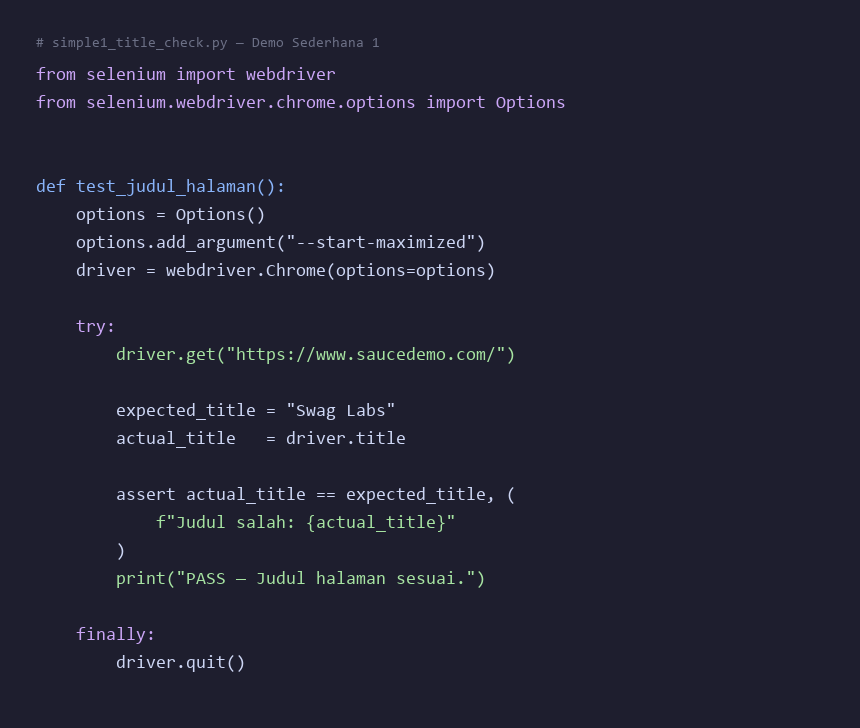
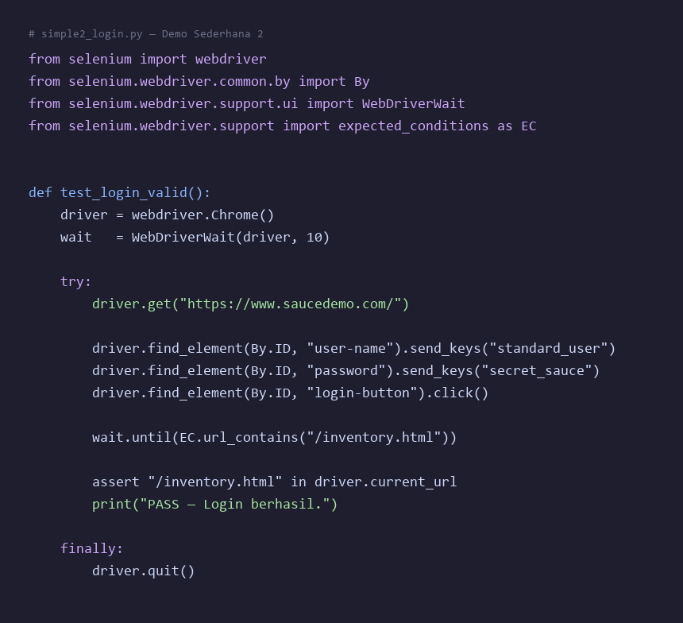
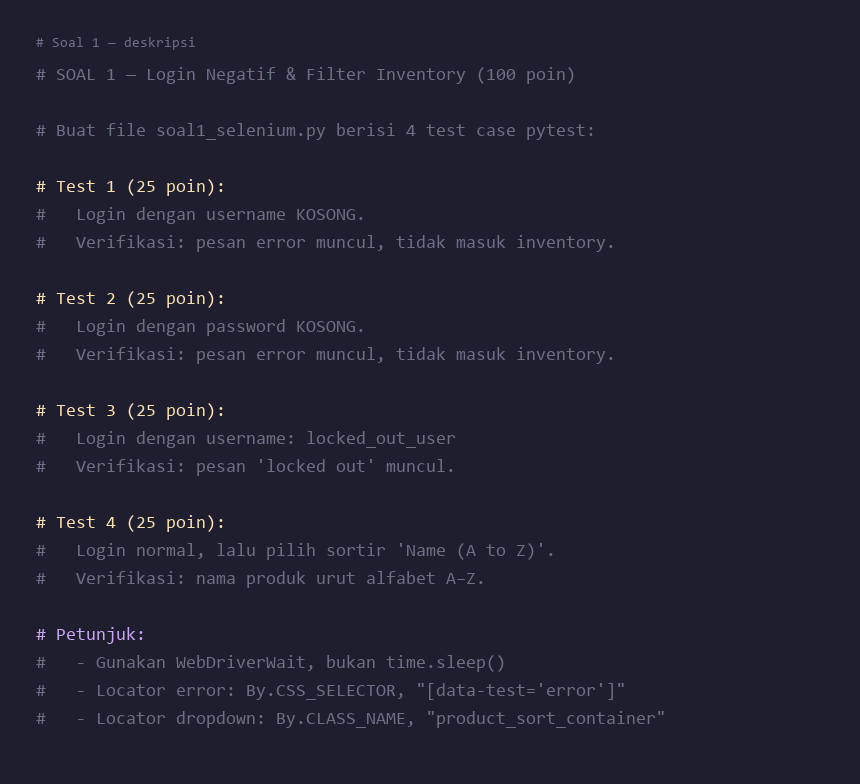

# Praktek 10 — Selenium Testing dengan Python

## Tujuan Pembelajaran

Setelah menyelesaikan praktek ini, mahasiswa mampu:
- Memahami konsep **Selenium WebDriver** dan cara kerja otomasi browser
- Menjalankan test sederhana: buka URL, ambil judul, dan verifikasi elemen
- Mensimulasikan interaksi pengguna: isi form, klik tombol, dan tunggu perubahan UI
- Menulis test end-to-end alur lengkap dengan **pytest** dan pola fixture
- Menerapkan **explicit wait** dengan `WebDriverWait` agar test stabil

---

## Latar Belakang

### Apa itu Selenium WebDriver?

**Selenium WebDriver** adalah library yang memungkinkan program mengendalikan browser (Chrome, Firefox, Edge) secara otomatis — mulai dari membuka URL, mengklik tombol, mengisi form, hingga mengambil teks dari halaman.

Selenium adalah standar industri untuk **browser automation** dan sudah digunakan lebih dari 15 tahun di berbagai perusahaan besar.

```
Program Python (test)
        │
        ▼
  Selenium WebDriver
        │
        ▼
   ChromeDriver  ←── perantara (driver)
        │
        ▼
   Google Chrome  ←── browser nyata yang dikendalikan
```

### Selenium vs Playwright

| Fitur | Selenium | Playwright |
|-------|----------|-----------|
| Bahasa utama | Java, Python, C# | JavaScript/TypeScript, Python |
| Pengelolaan driver | Manual / webdriver-manager | Built-in |
| Auto-wait | Tidak (perlu explicit/implicit wait) | Ya (otomatis) |
| Kematangan | 15+ tahun, ekosistem besar | Modern (2020+) |
| Populer di | Enterprise, korporat lama | Startup, tim modern |
| Cocok untuk | Praktik dasar, warisan sistem | Project baru |

Selenium dipilih di sini karena **paling banyak dipakai di dunia kerja** dan fundamental otomasi browser bisa dipahami lebih jelas.

### Mengapa Selenium Testing?

- Menguji UI persis seperti yang dilihat pengguna
- Tidak tergantung pada implementasi internal frontend
- Berjalan di browser nyata → menangkap masalah rendering, JavaScript, dan timing
- Dapat diintegrasikan ke CI/CD

---

## Persiapan

### 1. Prasyarat

- Python 3.10 atau lebih baru
- Google Chrome (versi terbaru)
- Koneksi internet (untuk mengakses `saucedemo.com`)

Cek Python:
```bash
python --version
```

### 2. Install Library

**Ketik perintah berikut dari gambar** ke terminal — biasakan membaca dan mengetik perintah, bukan menyalin langsung:



Perintah yang diketik:
```
pip install selenium pytest webdriver-manager
```

> **webdriver-manager** secara otomatis mendownload ChromeDriver yang cocok dengan versi Chrome kamu — tidak perlu setup manual.

### 3. Struktur Folder

Buat folder berikut untuk menyimpan semua file praktek ini:

```
praktek10/
├── simple1_title_check.py
├── simple2_login.py
├── advanced_purchase_flow.py
└── soal1_selenium.py        ← file jawaban soal
```

---

## 🧪 Demo Sederhana 1 — Verifikasi Judul Halaman

**Skenario:** Buka situs Swag Labs, ambil judul tab browser, dan verifikasi sesuai ekspektasi.

Ini adalah test Selenium paling dasar — hanya membuka URL dan membaca properti `driver.title`.

### Langkah DS1.1 — Tulis kode

Buat file `simple1_title_check.py`. **Ketik seluruh kode dari gambar berikut** (jangan copy-paste):



### Langkah DS1.2 — Jalankan

```bash
python simple1_title_check.py
```

Output yang diharapkan:
```
Judul halaman: Swag Labs
PASS — Judul halaman sesuai.
```

### Langkah DS1.3 — Amati

Saat kode berjalan, Chrome akan terbuka secara otomatis, membuka saucedemo.com, lalu menutup sendiri. Ini adalah **Selenium mengendalikan browser secara programatik**.

Poin-poin penting dari kode ini:
1. `Options()` + `add_argument` — konfigurasi Chrome sebelum dibuka
2. `webdriver.Chrome(options=options)` — membuat instance browser baru
3. `driver.get(url)` — membuka URL
4. `driver.title` — membaca judul tab
5. `driver.quit()` — **wajib** tutup browser di `finally` agar tidak ada Chrome yang tertinggal

---

## 🧪 Demo Sederhana 2 — Login dan Verifikasi URL

**Skenario:** Isi form login, klik tombol, tunggu halaman berubah, lalu verifikasi URL dan konten halaman.

### Langkah DS2.1 — Tulis kode

Buat file `simple2_login.py`. **Ketik seluruh kode dari gambar berikut:**



### Langkah DS2.2 — Jalankan

```bash
python simple2_login.py
```

Output yang diharapkan:
```
PASS — Login berhasil.
```

### Langkah DS2.3 — Pahami Konsep Wait

Baris `wait.until(EC.url_contains("/inventory.html"))` adalah kunci kestabilan test.

| Metode Wait | Cara Kerja | Kapan Dipakai |
|-------------|-----------|---------------|
| `time.sleep(3)` | Tunggu 3 detik tanpa syarat | Tidak disarankan — test jadi lambat dan rapuh |
| `implicitly_wait(5)` | Setiap `find_element` tunggu max 5 detik | Default yang nyaman untuk semua locator |
| `WebDriverWait + EC` | Tunggu **kondisi tertentu** terpenuhi, max N detik | **Terbaik** — cepat dan stabil |

**Praktik terbaik:** Gunakan `WebDriverWait` + `expected_conditions` untuk kondisi yang bisa berubah (URL, visibility, clickability).

---

## 🧪 Demo Advanced — Alur Pembelian End-to-End

**Skenario:** Simulasikan alur belanja lengkap: login → tambah 2 produk ke cart → checkout → isi form pengiriman → konfirmasi pembelian.

Berbeda dari demo sebelumnya, demo advanced ini menggunakan **pytest** dengan **fixture** untuk manajemen driver yang lebih rapi, dan menguji 3 skenario berbeda.

### Struktur Kode

```python
import pytest
from selenium import webdriver
from selenium.webdriver.chrome.options import Options
from selenium.webdriver.common.by import By
from selenium.webdriver.support.ui import WebDriverWait
from selenium.webdriver.support import expected_conditions as EC
from selenium.webdriver.support.ui import Select

BASE_URL = "https://www.saucedemo.com/"
USERNAME = "standard_user"
PASSWORD = "secret_sauce"

@pytest.fixture
def driver():
    options = Options()
    options.add_argument("--start-maximized")
    drv = webdriver.Chrome(options=options)
    drv.implicitly_wait(5)
    yield drv
    drv.quit()            # ← dijalankan otomatis setelah tiap test

def login(driver):
    driver.get(BASE_URL)
    driver.find_element(By.ID, "user-name").send_keys(USERNAME)
    driver.find_element(By.ID, "password").send_keys(PASSWORD)
    driver.find_element(By.ID, "login-button").click()
```

### Test 1 — Pembelian Lengkap

```python
def test_purchase_two_items_end_to_end(driver):
    wait = WebDriverWait(driver, 10)

    login(driver)
    wait.until(EC.url_contains("/inventory.html"))

    # Tambah 2 produk
    driver.find_element(By.ID, "add-to-cart-sauce-labs-backpack").click()
    driver.find_element(By.ID, "add-to-cart-sauce-labs-bike-light").click()

    badge = driver.find_element(By.CLASS_NAME, "shopping_cart_badge").text
    assert badge == "2"

    # Buka cart
    driver.find_element(By.CLASS_NAME, "shopping_cart_link").click()
    wait.until(EC.url_contains("/cart.html"))
    assert len(driver.find_elements(By.CLASS_NAME, "cart_item")) == 2

    # Checkout
    driver.find_element(By.ID, "checkout").click()
    driver.find_element(By.ID, "first-name").send_keys("Budi")
    driver.find_element(By.ID, "last-name").send_keys("Santoso")
    driver.find_element(By.ID, "postal-code").send_keys("60285")
    driver.find_element(By.ID, "continue").click()

    # Verifikasi total & finish
    total = driver.find_element(By.CLASS_NAME, "summary_total_label").text
    assert "Total:" in total

    driver.find_element(By.ID, "finish").click()
    wait.until(EC.url_contains("/checkout-complete.html"))

    msg = driver.find_element(By.CLASS_NAME, "complete-header").text
    assert msg == "Thank you for your order!"
```

### Test 2 — Logout

```python
def test_login_logout_flow(driver):
    wait = WebDriverWait(driver, 10)

    login(driver)
    wait.until(EC.url_contains("/inventory.html"))

    # Buka hamburger menu, lalu logout
    driver.find_element(By.ID, "react-burger-menu-btn").click()
    wait.until(
        EC.element_to_be_clickable((By.ID, "logout_sidebar_link"))
    ).click()

    wait.until(EC.url_to_be(BASE_URL))
    assert driver.current_url == BASE_URL
    assert driver.find_element(By.ID, "login-button").is_displayed()
```

### Test 3 — Sortir Harga

```python
def test_sort_produk_harga_termurah_ke_termahal(driver):
    wait = WebDriverWait(driver, 10)

    login(driver)
    wait.until(EC.url_contains("/inventory.html"))

    sort_dropdown = Select(
        driver.find_element(By.CLASS_NAME, "product_sort_container")
    )
    sort_dropdown.select_by_value("lohi")

    prices = [
        float(el.text.replace("$", ""))
        for el in driver.find_elements(By.CLASS_NAME, "inventory_item_price")
    ]
    assert prices == sorted(prices)
```

### Jalankan Demo Advanced

Simpan seluruh kode di atas sebagai `advanced_purchase_flow.py`, lalu:

```bash
pytest advanced_purchase_flow.py -v
```

Output yang diharapkan:

```
collected 3 items

advanced_purchase_flow.py::test_purchase_two_items_end_to_end  PASSED
advanced_purchase_flow.py::test_login_logout_flow              PASSED
advanced_purchase_flow.py::test_sort_produk_harga_termurah_ke_termahal  PASSED

========================= 3 passed =========================
```

---

## 📝 Soal 1 — Login Negatif & Filter Inventory (100 poin)

Buat file **`soal1_selenium.py`** berisi **4 test case pytest** menggunakan Selenium WebDriver.

**Petunjuk pengerjaan yang dapat kamu baca dari gambar:**



### Tugas 1.A — Test Login Negatif: Username Kosong (25 poin)

Nama fungsi: `test_login_username_kosong_tampilkan_error`

- Buka `https://www.saucedemo.com/`
- Biarkan field **username kosong**, isi password dengan `"secret_sauce"`, klik login
- **Verifikasi:**
  - Elemen error muncul (gunakan locator `[data-test='error']`)
  - Teks error mengandung `"Username is required"`
  - URL **tidak** berpindah ke `/inventory.html`

### Tugas 1.B — Test Login Negatif: Password Kosong (25 poin)

Nama fungsi: `test_login_password_kosong_tampilkan_error`

- Buka `https://www.saucedemo.com/`
- Isi username `"standard_user"`, biarkan **password kosong**, klik login
- **Verifikasi:**
  - Teks error mengandung `"Password is required"`
  - URL tidak berpindah ke `/inventory.html`

### Tugas 1.C — Test Login Negatif: Akun Terkunci (25 poin)

Nama fungsi: `test_login_akun_terkunci_tampilkan_error`

- Login dengan username `"locked_out_user"`, password `"secret_sauce"`
- **Verifikasi:**
  - Teks error mengandung kata `"locked out"` (case-insensitive)
  - URL tidak berpindah ke `/inventory.html`

### Tugas 1.D — Test Filter Inventory A–Z (25 poin)

Nama fungsi: `test_filter_inventory_nama_a_z`

- Login dengan `"standard_user"` / `"secret_sauce"`
- Pilih opsi sortir `"Name (A to Z)"` dari dropdown (gunakan `Select`)
- **Verifikasi:**
  - Ambil semua nama produk dengan locator `By.CLASS_NAME, "inventory_item_name"`
  - Bandingkan dengan versi yang sudah `sorted()` — harus sama

### Ketentuan Teknis

- **Gunakan `WebDriverWait`** untuk menunggu URL atau elemen, bukan `time.sleep()`
- Gunakan `pytest.fixture` untuk membuat dan menutup driver
- Semua 4 test harus `PASSED` saat dijalankan dengan `pytest soal1_selenium.py -v`

---

## Yang Dikumpulkan

```
praktek10_<NIM>_<Nama>/
├── simple1_title_check.py
├── simple2_login.py
├── advanced_purchase_flow.py
├── soal1_selenium.py
└── screenshots/
    ├── demo_sederhana1_output.png   ← terminal output Demo 1
    ├── demo_sederhana2_output.png   ← terminal output Demo 2
    ├── advanced_pytest_output.png   ← hasil pytest 3 PASSED
    └── soal1_pytest_output.png      ← hasil pytest 4 PASSED
```

---

## Kriteria Penilaian

| Bagian | Bobot | Indikator |
|--------|-------|-----------|
| Demo Sederhana 1 & 2 selesai | — | Wajib (gerbang) — prasyarat soal |
| Demo Advanced dijalankan | — | Screenshot 3 test PASSED |
| **Soal 1.A** Login username kosong | 25 | Assertion error text + URL benar |
| **Soal 1.B** Login password kosong | 25 | Assertion error text + URL benar |
| **Soal 1.C** Login akun terkunci | 25 | Assertion "locked out" case-insensitive |
| **Soal 1.D** Filter inventory A–Z | 25 | Sort menggunakan `Select`, assertion `sorted()` |
| **Total** | **100** | |

> **Catatan:** Penggunaan `time.sleep()` sebagai wait utama dikurangi 5 poin per test. Gunakan `WebDriverWait` + `expected_conditions`.
