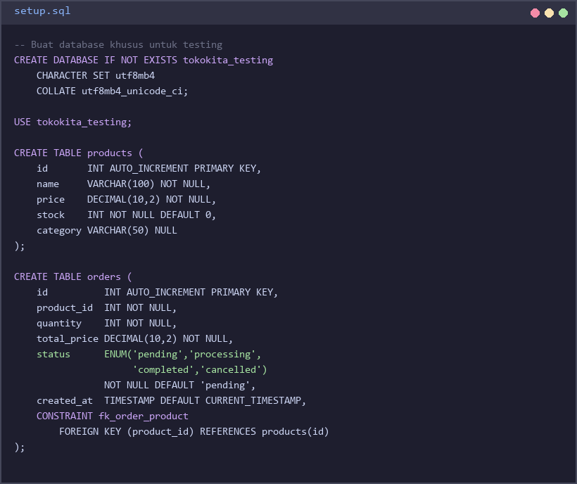
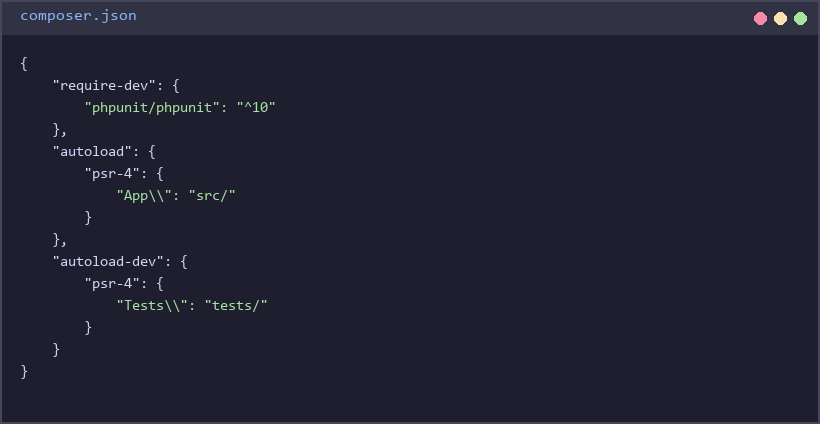
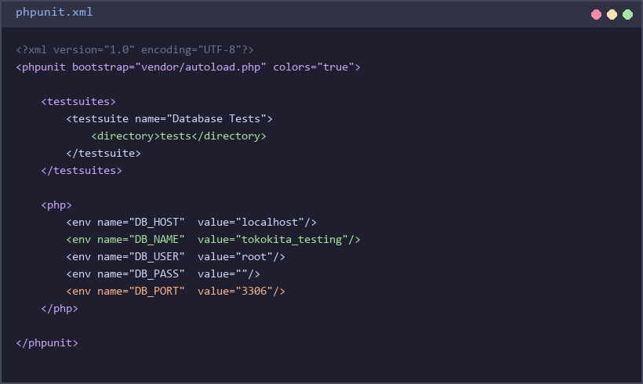
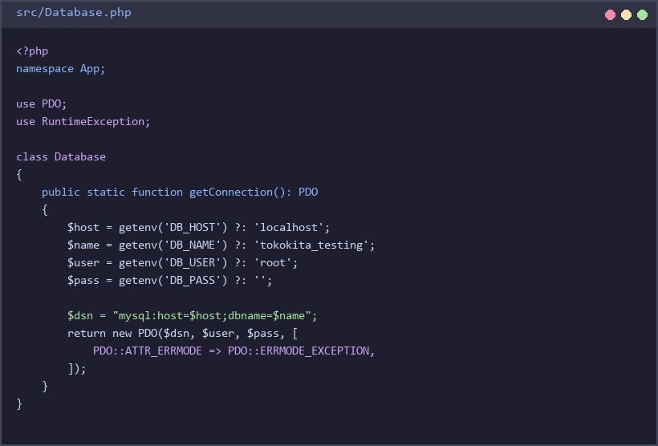
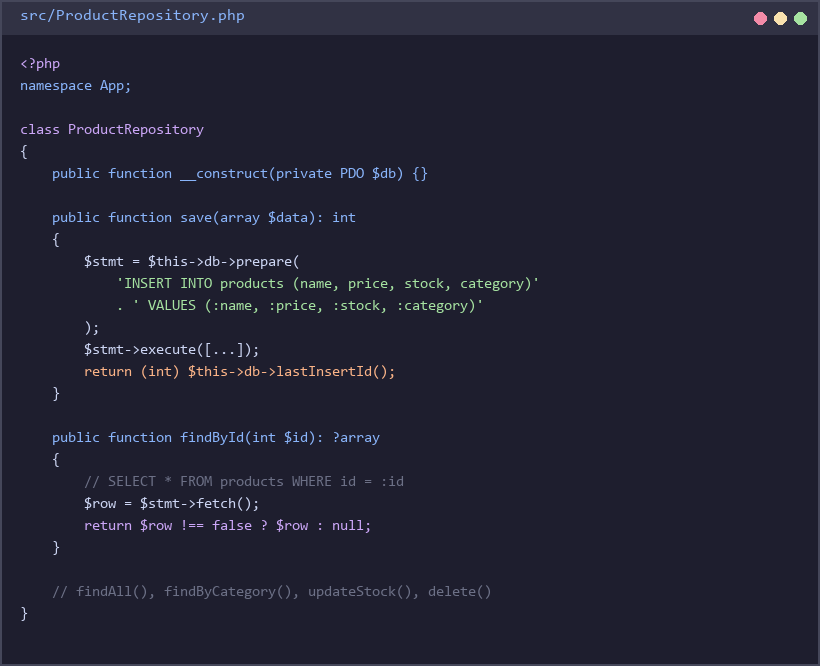
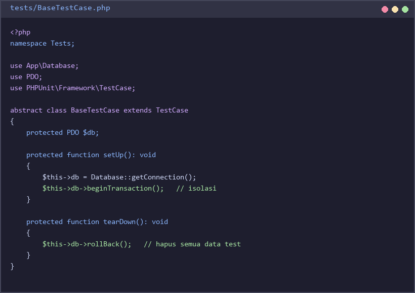
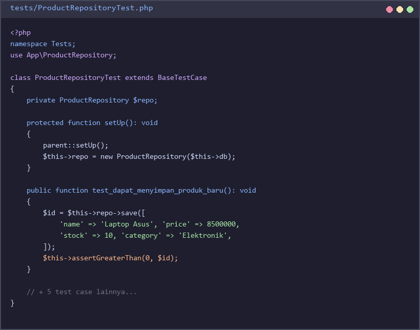
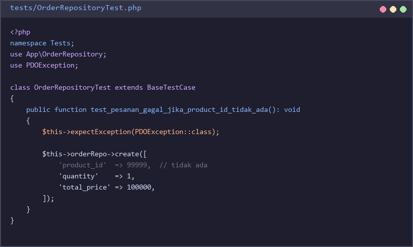
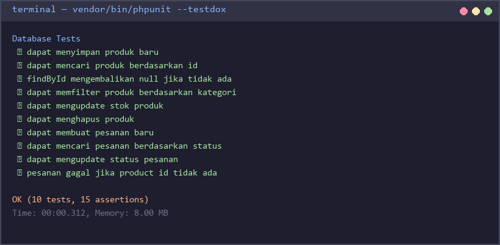

# Praktek 5 — Database Testing dengan MySQL dan PHPUnit

## Tujuan Pembelajaran

Setelah menyelesaikan praktek ini, mahasiswa mampu:
- Memahami konsep database testing dan isolasi data antar test
- Menulis test untuk operasi CRUD menggunakan PHPUnit dan MySQL
- Menerapkan teknik transaction rollback agar setiap test berjalan bersih
- Memvalidasi constraint dan relasi antar tabel melalui test

---

## Latar Belakang

Pada Praktek 2 (Integration Testing) kita menguji interaksi antar service PHP tanpa database.
Pada praktek ini, kita akan menguji **interaksi kode dengan database MySQL secara nyata**.

### Mengapa Database Testing Penting?

Bisa saja kode PHP sudah benar, tapi:
- Query SQL mengandung typo nama kolom
- Kondisi `WHERE` menghasilkan data yang salah
- Constraint `UNIQUE` atau `NOT NULL` tidak berfungsi seperti yang diharapkan
- Relasi antar tabel (foreign key) tidak terjaga

Semua masalah ini **hanya bisa ditemukan** dengan menjalankan test langsung ke database.

### Tantangan: Isolasi Data

Setiap test harus **tidak saling mempengaruhi**. Solusi yang digunakan pada praktek ini adalah **Transaction Rollback**:

```
setUp()     → BEGIN TRANSACTION
test_xxx()  → INSERT / SELECT / UPDATE / DELETE
tearDown()  → ROLLBACK  ← data kembali seperti semula
```

Dengan cara ini, setiap test selalu mulai dari kondisi database yang bersih.

---

## Skenario

Anda diminta membuat sistem manajemen produk dan pesanan untuk **Toko Online "TokoKita"**.

Sistem memiliki dua tabel:
- **`products`** — menyimpan data produk (nama, harga, stok, kategori)
- **`orders`** — menyimpan data pesanan yang merujuk ke produk

---

## Setup Lingkungan

### 1. Prasyarat

Pastikan sudah terinstall:
- PHP >= 8.0
- Composer
- MySQL Server (XAMPP / Laragon / standalone)
- PHPUnit (diinstall via Composer)

### 2. Buat Database dan Tabel

Buka MySQL client (phpMyAdmin / HeidiSQL / terminal) dan jalankan script berikut:



```sql
-- Buat database khusus untuk testing
CREATE DATABASE IF NOT EXISTS tokokita_testing
  CHARACTER SET utf8mb4
  COLLATE utf8mb4_unicode_ci;

USE tokokita_testing;

-- Tabel produk
CREATE TABLE products (
    id       INT AUTO_INCREMENT PRIMARY KEY,
    name     VARCHAR(100) NOT NULL,
    price    DECIMAL(10,2) NOT NULL,
    stock    INT NOT NULL DEFAULT 0,
    category VARCHAR(50) NULL
);

-- Tabel pesanan
CREATE TABLE orders (
    id          INT AUTO_INCREMENT PRIMARY KEY,
    product_id  INT NOT NULL,
    quantity    INT NOT NULL,
    total_price DECIMAL(10,2) NOT NULL,
    status      ENUM('pending','processing','completed','cancelled') NOT NULL DEFAULT 'pending',
    created_at  TIMESTAMP DEFAULT CURRENT_TIMESTAMP,
    CONSTRAINT fk_order_product FOREIGN KEY (product_id) REFERENCES products(id)
);
```

> File lengkap tersedia di: `setup.sql` (ada di folder jawaban sebagai referensi)

### 3. Struktur Folder Project

Buat folder baru dengan nama `praktek5_database_testing`, lalu buat struktur berikut:

```
praktek5_database_testing/
├── composer.json
├── phpunit.xml
├── src/
│   ├── Database.php
│   ├── ProductRepository.php
│   └── OrderRepository.php
└── tests/
    ├── BaseTestCase.php
    ├── ProductRepositoryTest.php
    └── OrderRepositoryTest.php
```

### 4. Konfigurasi Composer

Buat file `composer.json`:



```json
{
    "require-dev": {
        "phpunit/phpunit": "^10"
    },
    "autoload": {
        "psr-4": {
            "App\\": "src/"
        }
    },
    "autoload-dev": {
        "psr-4": {
            "Tests\\": "tests/"
        }
    }
}
```

Jalankan:
```bash
composer install
```

### 5. Konfigurasi PHPUnit

Buat file `phpunit.xml`:



```xml
<?xml version="1.0" encoding="UTF-8"?>
<phpunit xmlns:xsi="http://www.w3.org/2001/XMLSchema-instance"
         xsi:noNamespaceSchemaLocation="vendor/phpunit/phpunit/phpunit.xsd"
         bootstrap="vendor/autoload.php"
         colors="true">

    <testsuites>
        <testsuite name="Database Tests">
            <directory>tests</directory>
        </testsuite>
    </testsuites>

    <php>
        <env name="DB_HOST"   value="localhost"/>
        <env name="DB_NAME"   value="tokokita_testing"/>
        <env name="DB_USER"   value="root"/>
        <env name="DB_PASS"   value=""/>
        <env name="DB_PORT"   value="3306"/>
    </php>

</phpunit>
```

> Sesuaikan nilai `DB_USER` dan `DB_PASS` dengan konfigurasi MySQL Anda.

---

## Kelas yang Harus Diimplementasikan

### `src/Database.php`



Class ini bertanggung jawab membuka koneksi PDO ke MySQL.

Koneksi mengambil konfigurasi dari **environment variable** yang didefinisikan di `phpunit.xml`:
- `DB_HOST`, `DB_NAME`, `DB_USER`, `DB_PASS`, `DB_PORT`

Gunakan `PDO::ATTR_ERRMODE => PDO::ERRMODE_EXCEPTION` agar error database langsung dilempar sebagai exception.

---

### `src/ProductRepository.php`



Class ini mengelola operasi database untuk tabel `products`.

| Method | Parameter | Return | Keterangan |
|--------|-----------|--------|------------|
| `__construct(PDO $db)` | PDO instance | — | Dependency injection |
| `save(array $data)` | `name`, `price`, `stock`, `category` | `int` (id baru) | Insert produk baru |
| `findById(int $id)` | id | `array\|null` | Cari produk by id |
| `findAll()` | — | `array` | Semua produk |
| `findByCategory(string $cat)` | category | `array` | Filter by kategori |
| `updateStock(int $id, int $stock)` | id, stok baru | `bool` | Update stok produk |
| `delete(int $id)` | id | `bool` | Hapus produk |

---

### `src/OrderRepository.php`

Class ini mengelola operasi database untuk tabel `orders`.

| Method | Parameter | Return | Keterangan |
|--------|-----------|--------|------------|
| `__construct(PDO $db)` | PDO instance | — | Dependency injection |
| `create(array $data)` | `product_id`, `quantity`, `total_price` | `int` (id baru) | Buat pesanan baru |
| `findById(int $id)` | id | `array\|null` | Cari pesanan by id |
| `findByStatus(string $status)` | status | `array` | Filter pesanan by status |
| `updateStatus(int $id, string $status)` | id, status baru | `bool` | Update status pesanan |
| `countByProduct(int $productId)` | product_id | `int` | Hitung jumlah pesanan per produk |

---

## Soal

### Soal 1 — Setup dan Koneksi Database (20 poin)

a) Buat database `tokokita_testing` dan kedua tabel sesuai skema di atas.

b) Implementasikan `src/Database.php`. Class ini harus:
   - Membaca konfigurasi dari environment variable
   - Mengembalikan instance PDO
   - Melempar exception bila koneksi gagal

c) Buat `tests/BaseTestCase.php` sebagai parent class untuk semua test. Class ini harus:
   - Membuka koneksi ke database di `setUp()`
   - Memulai transaksi (`beginTransaction`) di `setUp()`
   - Melakukan rollback (`rollBack`) di `tearDown()`



Verifikasi: jalankan `vendor/bin/phpunit --list-tests` — harus tidak ada error koneksi.

---

### Soal 2 — Testing ProductRepository (40 poin)

Implementasikan `src/ProductRepository.php`, lalu buat `tests/ProductRepositoryTest.php` yang berisi minimal **6 test case** berikut:



| No | Nama Test | Yang Diuji |
|----|-----------|------------|
| 1 | `test_dapat_menyimpan_produk_baru` | Method `save()` menyimpan data dan mengembalikan id valid (> 0) |
| 2 | `test_dapat_mencari_produk_berdasarkan_id` | `findById()` mengembalikan data produk yang benar |
| 3 | `test_findById_mengembalikan_null_jika_tidak_ada` | `findById()` dengan id tidak ada mengembalikan `null` |
| 4 | `test_dapat_memfilter_produk_berdasarkan_kategori` | `findByCategory()` hanya mengembalikan produk kategori tersebut |
| 5 | `test_dapat_mengupdate_stok_produk` | `updateStock()` mengubah nilai stok di database |
| 6 | `test_dapat_menghapus_produk` | `delete()` menghapus produk, `findById()` sesudahnya mengembalikan `null` |

---

### Soal 3 — Testing OrderRepository (30 poin)

Implementasikan `src/OrderRepository.php`, lalu buat `tests/OrderRepositoryTest.php` yang berisi minimal **4 test case** berikut:



| No | Nama Test | Yang Diuji |
|----|-----------|------------|
| 1 | `test_dapat_membuat_pesanan_baru` | `create()` menyimpan pesanan dan mengembalikan id valid |
| 2 | `test_dapat_mencari_pesanan_berdasarkan_status` | `findByStatus('pending')` hanya mengembalikan pesanan pending |
| 3 | `test_dapat_mengupdate_status_pesanan` | `updateStatus()` mengubah status, diverifikasi dengan `findById()` |
| 4 | `test_pesanan_gagal_jika_product_id_tidak_ada` | `create()` dengan `product_id` yang tidak ada harus melempar exception |

---

### Soal 4 — Analisis dan Refleksi (10 poin)

Jawab pertanyaan berikut dalam file `REFLEKSI.md`:

1. Mengapa kita menggunakan **transaction rollback** di `tearDown()` bukan menghapus data dengan `DELETE` biasa?

2. Apa perbedaan antara test pada **Soal 3 No. 4** dengan test-test lainnya? Mengapa kita perlu menguji kasus error/gagal?

3. Jika ada **dua developer** menjalankan test secara bersamaan di database yang sama, apakah transaction rollback cukup untuk menjaga isolasi? Jelaskan!

---

## Cara Menjalankan Test

```bash
# Jalankan semua test
vendor/bin/phpunit

# Jalankan dengan output detail
vendor/bin/phpunit --testdox

# Jalankan satu file test saja
vendor/bin/phpunit tests/ProductRepositoryTest.php
```

### Contoh Output yang Diharapkan



```
Database Tests
 ✔ dapat menyimpan produk baru
 ✔ dapat mencari produk berdasarkan id
 ✔ findById mengembalikan null jika tidak ada
 ✔ dapat memfilter produk berdasarkan kategori
 ✔ dapat mengupdate stok produk
 ✔ dapat menghapus produk
 ✔ dapat membuat pesanan baru
 ✔ dapat mencari pesanan berdasarkan status
 ✔ dapat mengupdate status pesanan
 ✔ pesanan gagal jika product id tidak ada

OK (10 tests, 15 assertions)
```

---

## Kriteria Penilaian

| Soal | Bobot | Kriteria |
|------|-------|----------|
| Soal 1 | 20 poin | Database terbuat, koneksi berhasil, BaseTestCase dengan rollback benar |
| Soal 2 | 40 poin | Semua 6 test case ada, pass, dan assertion bermakna |
| Soal 3 | 30 poin | Semua 4 test case ada, pass, termasuk test kasus error |
| Soal 4 | 10 poin | Jawaban refleksi tepat dan menunjukkan pemahaman konsep |

**Total: 100 poin**
