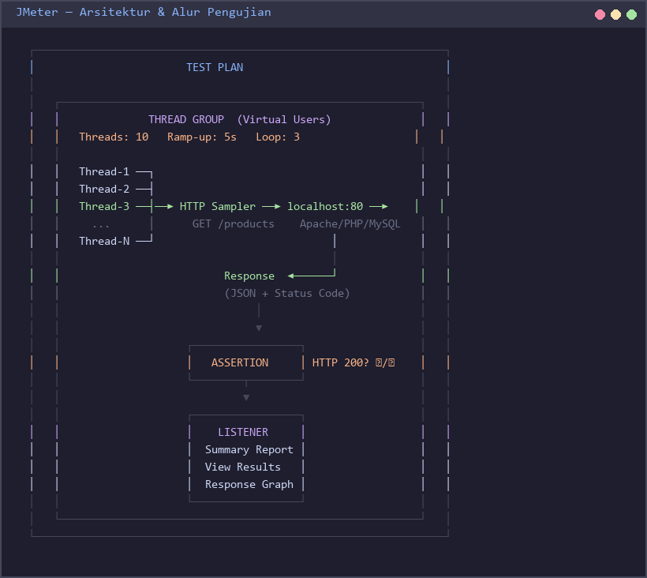
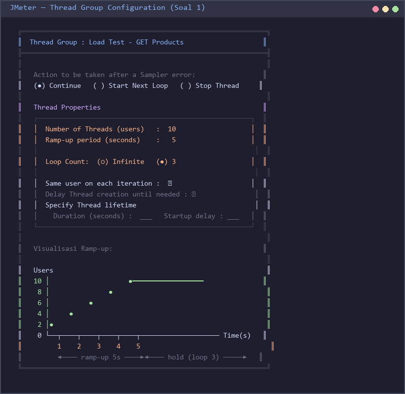
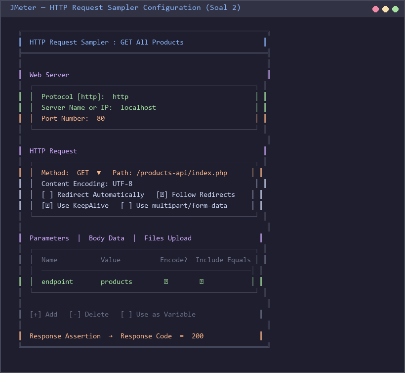
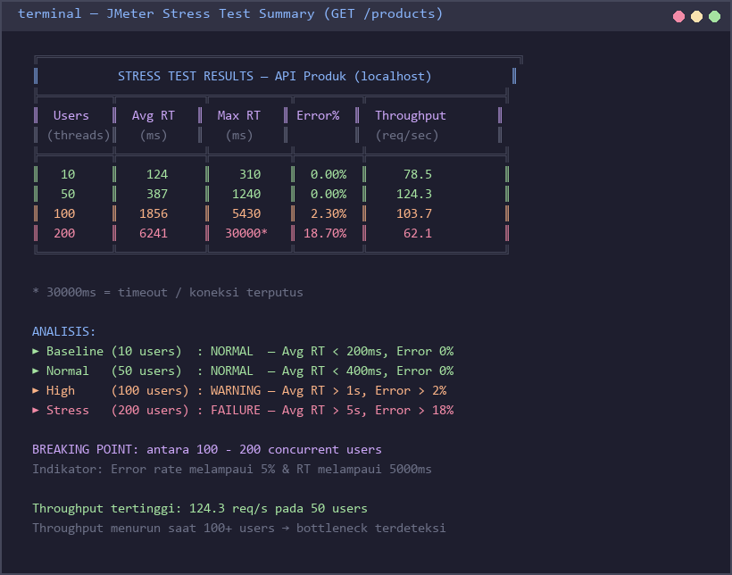
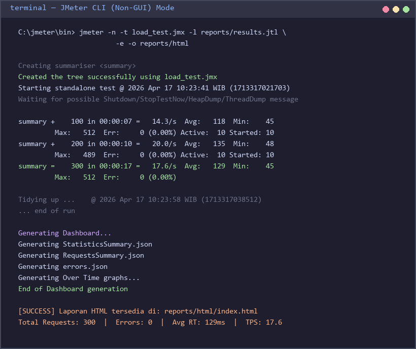

# Praktek 6 — Performance & Load Testing dengan Apache JMeter

## Tujuan Pembelajaran

Setelah menyelesaikan praktikum ini, mahasiswa diharapkan mampu:

- Memahami konsep dan tujuan **performance testing** pada aplikasi web berbasis REST API
- Menginstal dan mengkonfigurasi **Apache JMeter** sebagai alat load testing
- Membuat **Test Plan** JMeter untuk mensimulasikan beban pengguna secara bersamaan
- Menganalisis hasil pengujian berupa metrik **Response Time**, **Throughput**, dan **Error Rate**
- Mengidentifikasi **breaking point** sistem dan memberikan rekomendasi optimasi

---

## Latar Belakang

### Mengapa Performance Testing Penting?

Sebuah aplikasi yang lolos unit test dan integration test belum tentu mampu bertahan saat diakses oleh banyak pengguna secara bersamaan. Performance testing mensimulasikan kondisi nyata — ratusan atau ribuan pengguna mengakses API dalam waktu yang sama — untuk mengungkap bottleneck sebelum aplikasi diluncurkan ke produksi.

Bayangkan skenario: API produk toko online bekerja sempurna saat diuji satu per satu, namun saat flash sale terjadi dan 500 pengguna menekan tombol "Beli" secara bersamaan, server mengalami timeout dan transaksi gagal. Performance testing mencegah skenario seperti ini.

### Jenis-Jenis Performance Testing

| Jenis Test | Tujuan | Karakteristik |
|---|---|---|
| **Load Test** | Mengukur performa pada beban normal dan puncak yang diharapkan | Pengguna meningkat bertahap hingga target, lalu dipertahankan |
| **Stress Test** | Menemukan batas maksimum sistem (*breaking point*) | Beban terus ditingkatkan melebihi kapasitas normal |
| **Spike Test** | Menguji respons sistem terhadap lonjakan tiba-tiba | Beban naik drastis dalam waktu sangat singkat |
| **Soak Test** | Mendeteksi memory leak dan degradasi performa jangka panjang | Beban sedang dipertahankan selama berjam-jam atau berhari-hari |

### Metrik Utama

| Metrik | Definisi | Target Umum |
|---|---|---|
| **Response Time** | Waktu dari request dikirim hingga response diterima | < 2000 ms (ideal < 500 ms) |
| **Throughput** | Jumlah request yang berhasil diproses per detik | Semakin tinggi semakin baik |
| **Error Rate** | Persentase request yang gagal (non-2xx) | < 1% |
| **Concurrent Users** | Jumlah pengguna yang mengakses sistem secara bersamaan | Sesuai kebutuhan bisnis |

---

## Persiapan

### 1. Prasyarat

Pastikan semua komponen berikut telah tersedia:

- **XAMPP** (sudah terinstal dari praktikum sebelumnya) dengan Apache dan MySQL berjalan
- **API Produk** dari praktikum sebelumnya dapat diakses di `http://localhost/products-api/`
- **Java JDK 8 atau lebih baru** — JMeter membutuhkan Java
  - Cek dengan: `java -version`
  - Unduh dari: https://adoptium.net/
- **Apache JMeter 5.6+**
  - Unduh dari: https://jmeter.apache.org/download_jmeter.cgi
  - Pilih **Binaries** → `apache-jmeter-5.6.x.zip`
  - Ekstrak ke folder yang mudah diakses, misalnya `C:\jmeter\`
- **Plugin Manager** (opsional, untuk Soal 3):
  - Unduh `jmeter-plugins-manager-1.9.jar`
  - Letakkan di `C:\jmeter\lib\ext\`

### 2. Menjalankan API Server

1. Buka **XAMPP Control Panel**, klik **Start** pada Apache dan MySQL
2. Verifikasi API berjalan dengan membuka browser:
   ```
   http://localhost/products-api/index.php?endpoint=products
   ```
   Seharusnya menampilkan JSON seperti:
   ```json
   {"success": true, "data": [...], "message": "OK"}
   ```
3. Jika belum ada data, import `setup.sql` dari Praktek 5 ke phpMyAdmin

### 3. Struktur Folder

Buat struktur berikut di dalam folder `testingandimplementasi-praktek/`:

```
praktek6_performance_testing/
├── test_plans/
│   ├── load_test.jmx
│   └── stress_test.jmx
└── reports/
    └── (hasil test akan masuk sini)
```

Buat folder dengan perintah (Windows CMD/PowerShell):
```bash
mkdir praktek6_performance_testing\test_plans
mkdir praktek6_performance_testing\reports
```

---

## Konsep JMeter

Apache JMeter bekerja dengan komponen-komponen berikut yang disusun secara hierarkis di dalam sebuah **Test Plan**:

| Komponen | Fungsi | Analogi |
|---|---|---|
| **Test Plan** | Wadah utama seluruh konfigurasi pengujian | Proyek pengujian |
| **Thread Group** | Mendefinisikan jumlah virtual users, ramp-up, dan loop | Kelompok pengguna |
| **HTTP Request Sampler** | Mendefinisikan satu request HTTP (method, URL, body) | Satu aksi pengguna |
| **Listener** | Mengumpulkan dan menampilkan hasil pengujian | Laporan/grafik |
| **Assertion** | Memvalidasi bahwa response sesuai ekspektasi | Pengecekan otomatis |
| **Config Element** | Menyediakan konfigurasi bersama (Header, CSV Data) | Pengaturan global |

### Alur Kerja JMeter



Setiap **Thread** (virtual user) menjalankan semua **Sampler** dalam Thread Group secara berurutan. JMeter meluncurkan thread sesuai pengaturan **Ramp-Up Period** — misalnya 10 users dengan ramp-up 10 detik berarti 1 user baru ditambahkan setiap detik.

---

## Soal

### Soal 1 — Setup JMeter dan Basic Load Test (30 poin)

**Tujuan:** Menginstal JMeter, membuat Test Plan pertama, dan menjalankan load test sederhana pada endpoint `GET /products`.

#### Langkah-langkah

**A. Menjalankan JMeter**

1. Buka folder instalasi JMeter, masuk ke `bin/`
2. Jalankan `jmeter.bat` (Windows) atau `jmeter.sh` (Linux/Mac)
3. GUI JMeter akan terbuka dengan Test Plan kosong

**B. Membuat Thread Group**

1. Klik kanan **Test Plan** → Add → Threads (Users) → **Thread Group**
2. Beri nama: `Load Test - GET Products`
3. Konfigurasi:
   - **Number of Threads (users):** `10`
   - **Ramp-up period (seconds):** `5`
   - **Loop Count:** `3`



**C. Menambahkan HTTP Request**

1. Klik kanan **Thread Group** → Add → Sampler → **HTTP Request**
2. Konfigurasi:
   - **Name:** `GET All Products`
   - **Protocol:** `http`
   - **Server Name or IP:** `localhost`
   - **Port Number:** `80`
   - **HTTP Method:** `GET`
   - **Path:** `/products-api/index.php`
   - Di bagian **Parameters**, tambahkan:
     - Name: `endpoint`, Value: `products`

**D. Menambahkan Listeners**

1. Klik kanan **Thread Group** → Add → Listener → **View Results Tree**
2. Klik kanan **Thread Group** → Add → Listener → **Summary Report**

**E. Simpan dan Jalankan**

1. Simpan Test Plan: File → Save As → `test_plans/load_test.jmx`
2. Klik tombol **Run** (segitiga hijau) atau tekan `Ctrl+R`
3. Amati hasil di **Summary Report**

#### Contoh File JMX (load_test.jmx)

```xml
<?xml version="1.0" encoding="UTF-8"?>
<jmeterTestPlan version="1.2" properties="5.0" jmeter="5.6.3">
  <hashTree>
    <TestPlan guiclass="TestPlanGui" testclass="TestPlan"
              testname="Praktek 6 - Load Test" enabled="true">
      <boolProp name="TestPlan.functional_mode">false</boolProp>
      <boolProp name="TestPlan.serialize_threadgroups">false</boolProp>
      <elementProp name="TestPlan.arguments" elementType="Arguments">
        <collectionProp name="Arguments.arguments"/>
      </elementProp>
    </TestPlan>
    <hashTree>

      <!-- ── Thread Group ──────────────────────────────────── -->
      <ThreadGroup guiclass="ThreadGroupGui" testclass="ThreadGroup"
                   testname="Load Test - GET Products" enabled="true">
        <stringProp name="ThreadGroup.num_threads">10</stringProp>
        <stringProp name="ThreadGroup.ramp_time">5</stringProp>
        <intProp name="ThreadGroup.num_threads">10</intProp>
        <boolProp name="ThreadGroup.same_user_on_next_iteration">true</boolProp>
        <stringProp name="ThreadGroup.on_sample_error">continue</stringProp>
        <elementProp name="ThreadGroup.main_controller"
                     elementType="LoopController">
          <boolProp name="LoopController.continue_forever">false</boolProp>
          <stringProp name="LoopController.loops">3</stringProp>
        </elementProp>
      </ThreadGroup>
      <hashTree>

        <!-- ── HTTP Request ───────────────────────────────── -->
        <HTTPSamplerProxy guiclass="HttpTestSampleGui"
                          testclass="HTTPSamplerProxy"
                          testname="GET All Products" enabled="true">
          <stringProp name="HTTPSampler.domain">localhost</stringProp>
          <stringProp name="HTTPSampler.port">80</stringProp>
          <stringProp name="HTTPSampler.protocol">http</stringProp>
          <stringProp name="HTTPSampler.path">/products-api/index.php</stringProp>
          <stringProp name="HTTPSampler.method">GET</stringProp>
          <boolProp name="HTTPSampler.follow_redirects">true</boolProp>
          <boolProp name="HTTPSampler.use_keepalive">true</boolProp>
          <elementProp name="HTTPsampler.Arguments"
                       elementType="Arguments">
            <collectionProp name="Arguments.arguments">
              <elementProp name="endpoint" elementType="HTTPArgument">
                <boolProp name="HTTPArgument.always_encode">false</boolProp>
                <stringProp name="Argument.name">endpoint</stringProp>
                <stringProp name="Argument.value">products</stringProp>
              </elementProp>
            </collectionProp>
          </elementProp>
        </HTTPSamplerProxy>
        <hashTree/>

        <!-- ── Summary Report Listener ───────────────────── -->
        <ResultCollector guiclass="SummaryReport"
                         testclass="ResultCollector"
                         testname="Summary Report" enabled="true">
          <boolProp name="ResultCollector.error_logging">false</boolProp>
          <objProp>
            <name>saveConfig</name>
            <value class="SampleSaveConfiguration">
              <time>true</time>
              <latency>true</latency>
              <timestamp>true</timestamp>
              <success>true</success>
              <label>true</label>
              <code>true</code>
              <message>true</message>
              <threadName>true</threadName>
              <dataType>true</dataType>
              <encoding>false</encoding>
              <assertions>true</assertions>
              <subresults>true</subresults>
              <responseData>false</responseData>
              <samplerData>false</samplerData>
              <xml>false</xml>
              <fieldNames>true</fieldNames>
              <responseHeaders>false</responseHeaders>
              <requestHeaders>false</requestHeaders>
              <responseDataOnError>false</responseDataOnError>
              <saveAssertionResultsFailureMessage>true</saveAssertionResultsFailureMessage>
              <assertionsResultsToSave>0</assertionsResultsToSave>
              <bytes>true</bytes>
              <sentBytes>true</sentBytes>
              <threadCounts>true</threadCounts>
              <idleTime>true</idleTime>
              <connectTime>true</connectTime>
            </value>
          </objProp>
          <stringProp name="filename">reports/summary_results.jtl</stringProp>
        </ResultCollector>
        <hashTree/>

      </hashTree>
    </hashTree>
  </hashTree>
</jmeterTestPlan>
```

#### Yang Harus Dikumpulkan

- [ ] Screenshot **Summary Report** setelah test selesai
- [ ] Screenshot **View Results Tree** menampilkan minimal satu request sukses
- [ ] File `load_test.jmx`
- [ ] Jawab: Berapa total request yang dikirim? (Threads × Loop Count)

---

### Soal 2 — Load Test dengan Multiple Endpoints (30 poin)

**Tujuan:** Mensimulasikan alur lengkap pengguna yang berinteraksi dengan semua endpoint API (CRUD), disertai validasi response dan penggunaan data dinamis dari CSV.

#### Langkah-langkah

**A. Buat CSV Data File**

Buat file `test_plans/products_data.csv`:
```csv
name,price,stock,category
Laptop Asus,8500000,10,Elektronik
Mouse Logitech,350000,50,Aksesoris
Keyboard Mechanical,750000,30,Aksesoris
Monitor 24inch,3200000,15,Elektronik
Headphone Sony,1200000,25,Elektronik
```

**B. Tambahkan CSV Data Set Config**

1. Klik kanan **Thread Group** → Add → Config Element → **CSV Data Set Config**
2. Konfigurasi:
   - **Filename:** `test_plans/products_data.csv`
   - **Variable Names:** `name,price,stock,category`
   - **Delimiter:** `,`
   - **Recycle on EOF:** `True`
   - **Stop thread on EOF:** `False`

**C. Buat 4 HTTP Request Samplers**



Tambahkan 4 sampler berikut secara berurutan di dalam Thread Group:

| No | Nama Sampler | Method | Path | Body / Parameter |
|---|---|---|---|---|
| 1 | `GET All Products` | GET | `/products-api/index.php` | `endpoint=products` |
| 2 | `POST Create Product` | POST | `/products-api/index.php` | `endpoint=products` + JSON body |
| 3 | `GET Product by ID` | GET | `/products-api/index.php` | `endpoint=products&id=1` |
| 4 | `DELETE Product` | DELETE | `/products-api/index.php` | `endpoint=products&id=1` |

Untuk **POST Create Product**, tambahkan HTTP Header Manager:
- Klik kanan sampler POST → Add → Config Element → **HTTP Header Manager**
- Tambahkan header: `Content-Type` = `application/json`
- Body Data (tab **Body Data**):
  ```json
  {
    "name": "${name}",
    "price": ${price},
    "stock": ${stock},
    "category": "${category}"
  }
  ```

**D. Tambahkan Response Assertion**

Untuk setiap sampler, tambahkan Response Assertion:
1. Klik kanan sampler → Add → Assertions → **Response Assertion**
2. Untuk GET dan DELETE: Field to Test = **Response Code**, Pattern = `200`
3. Untuk POST: Field to Test = **Response Code**, Pattern = `201`

**E. Konfigurasi Thread Group**

- **Number of Threads:** `20`
- **Ramp-up period:** `10`
- **Loop Count:** `5`

**F. Tambahkan Aggregate Report**

Klik kanan Thread Group → Add → Listener → **Aggregate Report**

#### Yang Harus Dikumpulkan

- [ ] Screenshot **Aggregate Report** menampilkan semua 4 endpoint
- [ ] Screenshot salah satu **Response Assertion** yang dikonfigurasi
- [ ] File CSV data yang digunakan
- [ ] Jawab: Endpoint mana yang memiliki response time tertinggi? Mengapa?

---

### Soal 3 — Stress Test dan Analisis (30 poin)

**Tujuan:** Menemukan breaking point sistem dengan meningkatkan beban secara bertahap, kemudian menganalisis grafik performa.

#### Langkah-langkah

**A. Instalasi Plugin Stepping Thread Group (Opsional)**

Jika Plugin Manager sudah terinstal:
1. Options → Plugins Manager → Available Plugins
2. Cari `Stepping Thread Group`, install, restart JMeter

Alternatif tanpa plugin: Buat **4 Thread Group terpisah** dengan beban berbeda dan jalankan secara berurutan (centang **Run Thread Groups Consecutively** di Test Plan).

**B. Konfigurasi Stress Test**

Buat Test Plan baru `test_plans/stress_test.jmx` dengan beban bertahap:

| Tahap | Jumlah Users | Ramp-up | Hold Time | Keterangan |
|---|---|---|---|---|
| Baseline | 10 | 10s | 30s | Beban normal ringan |
| Normal | 50 | 20s | 30s | Beban normal puncak |
| High | 100 | 30s | 30s | Beban tinggi |
| Stress | 200 | 40s | 30s | Melebihi kapasitas |

Jika menggunakan Thread Group terpisah, buat 4 Thread Group dengan konfigurasi di atas. Tambahkan **HTTP Request** `GET /products` di setiap Thread Group.

**C. Tambahkan Listeners untuk Analisis**

- **Response Time Graph** — menampilkan tren response time
- **Active Threads Over Time** — menampilkan jumlah thread aktif
- **Transactions per Second** — menampilkan throughput

**D. Jalankan dan Catat Hasil**

Jalankan test dan isi tabel analisis berikut:

| Concurrent Users | Avg Response Time (ms) | Max RT (ms) | Error % | Throughput (req/s) |
|---|---|---|---|---|
| 10 | ??? | ??? | ??? | ??? |
| 50 | ??? | ??? | ??? | ??? |
| 100 | ??? | ??? | ??? | ??? |
| 200 | ??? | ??? | ??? | ??? |



**E. Identifikasi Breaking Point**

Breaking point adalah titik di mana salah satu kondisi berikut terpenuhi:
- Error rate melebihi **5%**
- Average response time melebihi **5000 ms**
- Throughput berhenti meningkat atau justru menurun

Tandai pada tabel di atas: di level berapa breaking point terjadi?

#### Yang Harus Dikumpulkan

- [ ] Screenshot **Response Time Graph** dari seluruh skenario
- [ ] Tabel analisis terisi lengkap dengan data aktual
- [ ] Penjelasan tertulis: di level berapa breaking point terjadi dan bukti data apa yang mendukungnya
- [ ] File `stress_test.jmx`

---

### Soal 4 — Refleksi (10 poin)

Jawab ketiga pertanyaan berikut dalam **file Markdown atau dokumen Word**. Setiap jawaban minimal 3–5 kalimat.

1. **Breaking Point:** Apa yang dimaksud dengan *breaking point* dalam konteks performance testing? Jelaskan menggunakan data hasil pengujian Anda pada Soal 3 — pada level berapa sistem mulai menunjukkan tanda-tanda kegagalan, dan metrik apa yang menjadi indikatornya?

2. **Perbaikan Bottleneck:** Dari hasil stress test Anda, sebutkan minimal **dua strategi konkret** yang dapat diterapkan untuk meningkatkan kapasitas API produk. Hubungkan strategi tersebut dengan temuan spesifik dari data pengujian (misalnya: jika error rate tinggi pada 100 users, strategi apa yang paling relevan?).

3. **Load vs Stress Test:** Jelaskan perbedaan mendasar antara *load test* dan *stress test* dari sisi **tujuan**, **konfigurasi Thread Group**, dan **interpretasi hasil**. Berikan contoh skenario nyata kapan masing-masing jenis test lebih tepat digunakan.

---

## Cara Menjalankan JMeter

### Mode GUI

Digunakan untuk **membuat dan debugging** Test Plan. Tidak disarankan untuk pengujian skala besar karena GUI mengonsumsi banyak resource.

### Mode CLI (Non-GUI) — Direkomendasikan untuk Test Aktual

Mode CLI lebih ringan dan menghasilkan laporan yang lebih akurat.

```bash
# Pindah ke folder JMeter
cd C:\jmeter\bin

# Jalankan load test dan generate laporan HTML
jmeter -n -t "D:\path\ke\praktek6_performance_testing\test_plans\load_test.jmx" ^
       -l "D:\path\ke\praktek6_performance_testing\reports\results.jtl" ^
       -e ^
       -o "D:\path\ke\praktek6_performance_testing\reports\html"
```

Keterangan flag:
| Flag | Fungsi |
|---|---|
| `-n` | Non-GUI mode |
| `-t` | Path ke file `.jmx` (Test Plan) |
| `-l` | Path ke file output `.jtl` (hasil mentah) |
| `-e` | Generate laporan HTML setelah test selesai |
| `-o` | Folder output laporan HTML (harus kosong atau belum ada) |

Setelah selesai, buka `reports/html/index.html` di browser untuk melihat laporan interaktif.



> **Catatan:** Folder output untuk `-o` harus **kosong atau belum ada**. Hapus isi folder `reports/html/` sebelum menjalankan test ulang.

---

## Kriteria Penilaian

| Soal | Komponen | Bobot |
|---|---|---|
| **Soal 1** | JMeter terinstal, Thread Group dikonfigurasi benar | 10 poin |
| **Soal 1** | Test berjalan, screenshot Summary Report tersedia | 10 poin |
| **Soal 1** | File `.jmx` valid dan dapat diimport ulang | 10 poin |
| **Soal 2** | 4 endpoint dikonfigurasi dengan benar | 10 poin |
| **Soal 2** | Response Assertion pada setiap sampler | 10 poin |
| **Soal 2** | CSV Data Set Config berfungsi, Aggregate Report tersedia | 10 poin |
| **Soal 3** | Stress test dengan minimal 3 level beban berbeda | 10 poin |
| **Soal 3** | Tabel analisis diisi dengan data aktual | 10 poin |
| **Soal 3** | Breaking point teridentifikasi dan dijelaskan | 10 poin |
| **Soal 4** | Ketiga pertanyaan dijawab dengan lengkap dan tepat | 10 poin |
| **Total** | | **100 poin** |

---

## Referensi

- Dokumentasi resmi Apache JMeter: https://jmeter.apache.org/usermanual/
- JMeter Best Practices: https://jmeter.apache.org/usermanual/best-practices.html
- JMeter Plugin Manager: https://jmeter-plugins.org/install/Install/
