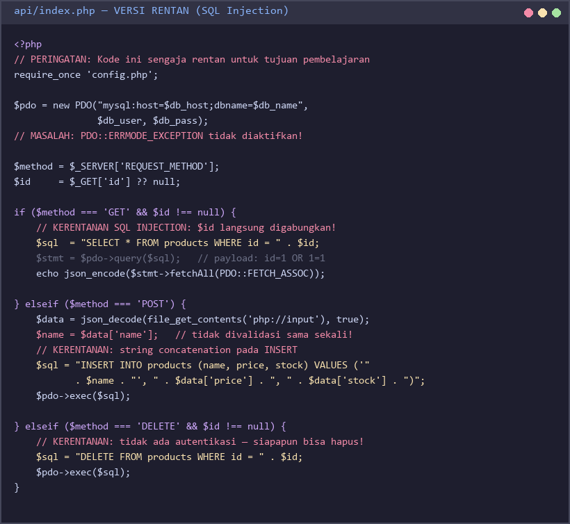
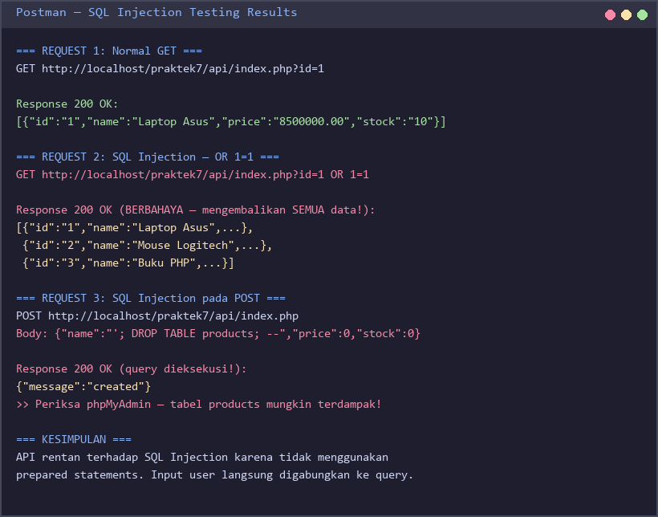
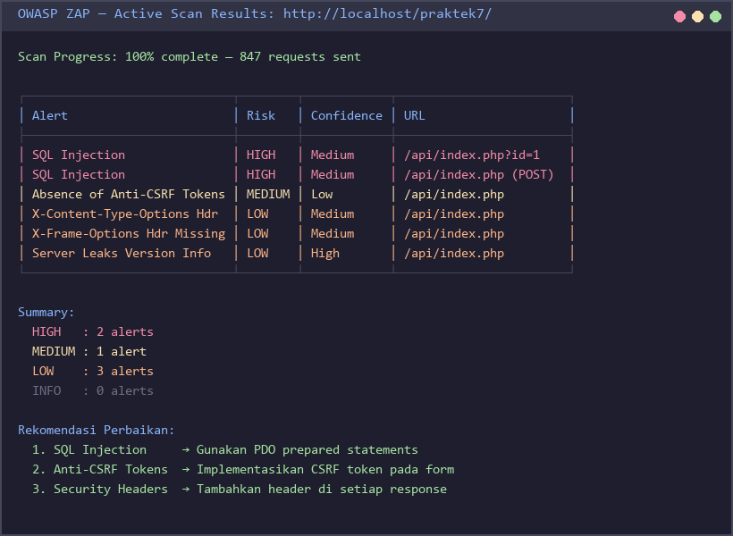
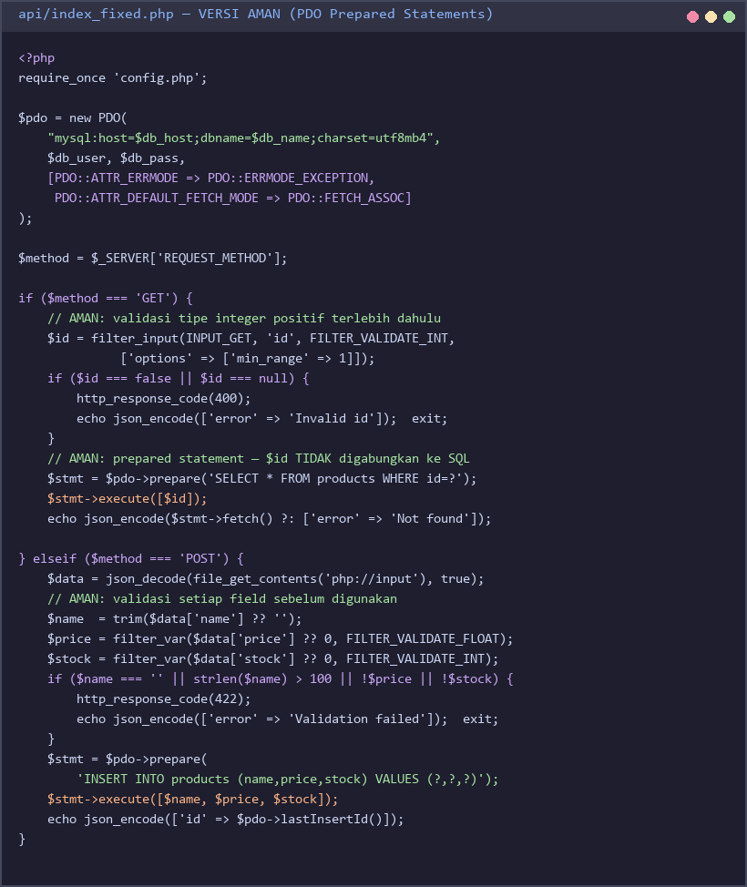
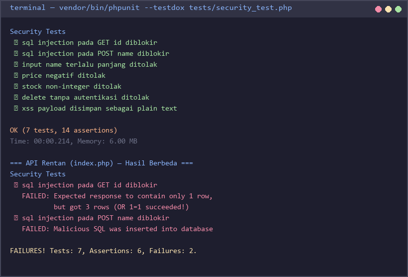

# Praktek 7 — Security Testing dengan OWASP ZAP dan Postman

## Tujuan Pembelajaran

Setelah menyelesaikan praktek ini, mahasiswa mampu:
- Memahami konsep OWASP Top 10 dan ancaman keamanan umum pada aplikasi web
- Mengidentifikasi dan mengeksploitasi kerentanan SQL Injection pada aplikasi PHP
- Memahami konsep Broken Authentication dan pentingnya validasi input
- Menerapkan perbaikan keamanan menggunakan PDO prepared statements dan input validation
- Menggunakan tools security testing: OWASP ZAP (DAST) dan Postman (manual testing)

---

## Latar Belakang

### Mengapa Security Testing Penting?

Aplikasi yang **berfungsi dengan benar** belum tentu **aman**. Fungsional testing memastikan fitur bekerja sesuai spesifikasi, sedangkan **security testing** memastikan aplikasi tidak dapat disalahgunakan oleh penyerang.

Statistik menunjukkan bahwa:
- Lebih dari **60%** pelanggaran data disebabkan oleh kerentanan yang sudah diketahui
- SQL Injection masuk dalam daftar OWASP Top 10 selama lebih dari **15 tahun berturut-turut**
- Biaya memperbaiki kerentanan setelah deployment **100x lebih mahal** dibanding saat development

### OWASP Top 10

OWASP (Open Web Application Security Project) menerbitkan daftar 10 risiko keamanan aplikasi web yang paling kritis:

| Peringkat | Nama | Contoh Serangan |
|-----------|------|-----------------|
| A01 | Broken Access Control | Mengakses data user lain dengan mengganti ID di URL |
| A02 | Cryptographic Failures | Password disimpan sebagai plain text di database |
| A03 | Injection | SQL Injection: `' OR 1=1 --` pada form login |
| A04 | Insecure Design | Tidak ada rate limiting pada endpoint login |
| A05 | Security Misconfiguration | Error message menampilkan stack trace ke user |
| A06 | Vulnerable Components | Menggunakan library dengan CVE yang diketahui |
| A07 | Authentication Failures | Session token yang mudah ditebak |
| A08 | Data Integrity Failures | Deserialisasi data yang tidak divalidasi |
| A09 | Logging Failures | Tidak ada log untuk aktivitas login gagal |
| A10 | SSRF | Aplikasi mengambil URL arbitrary dari input user |

### Jenis Security Testing

**SAST (Static Application Security Testing)**
- Menganalisis kode sumber tanpa menjalankan program
- Menemukan kerentanan di level kode
- Contoh tools: SonarQube, PHPStan, Psalm

**DAST (Dynamic Application Security Testing)**
- Menguji aplikasi yang sedang berjalan
- Mensimulasikan serangan nyata dari luar
- Contoh tools: **OWASP ZAP**, Burp Suite

### Tools yang Digunakan

| Tool | Jenis | Fungsi |
|------|-------|--------|
| OWASP ZAP | DAST | Automated vulnerability scanning |
| Postman | Manual DAST | Mengirim request berbahaya secara manual |
| PHPUnit | Unit Testing | Memverifikasi perbaikan keamanan |

---

## Persiapan

### 1. Prasyarat

Pastikan sudah terinstall:
- PHP >= 8.0
- Composer
- MySQL Server (XAMPP / Laragon)
- Postman
- Java 11+ (diperlukan oleh OWASP ZAP)
- OWASP ZAP (diinstall di langkah berikutnya)

### 2. Install OWASP ZAP

1. Buka browser dan kunjungi: **https://www.zaproxy.org/download/**
2. Unduh versi **ZAP 2.15.x** sesuai sistem operasi (Windows Installer)
3. Jalankan installer dan ikuti langkah instalasi default
4. Buka ZAP → pilih **"No, I do not want to persist this session"** saat pertama kali dijalankan
5. Verifikasi ZAP berjalan dengan melihat jendela utama ZAP terbuka

> **Catatan:** ZAP memerlukan Java. Jika muncul error, pastikan Java sudah terinstall dengan menjalankan `java -version` di terminal.

### 3. Setup API yang Rentan

Kita akan membuat **API yang sengaja mengandung kerentanan** untuk tujuan pembelajaran. API ini **TIDAK BOLEH** digunakan di lingkungan produksi.

Salin file dari `jawaban/praktek7_security_testing/api/` ke folder XAMPP:
```
C:/xampp/htdocs/praktek7/
├── config.php
├── index.php          (← API rentan, untuk diuji)
└── index_fixed.php    (← API yang sudah diperbaiki)
```

Buat database dengan menjalankan script SQL berikut di phpMyAdmin:

```sql
CREATE DATABASE IF NOT EXISTS tokokita_security CHARACTER SET utf8mb4;

USE tokokita_security;

CREATE TABLE products (
    id       INT AUTO_INCREMENT PRIMARY KEY,
    name     VARCHAR(100) NOT NULL,
    price    DECIMAL(10,2) NOT NULL,
    stock    INT NOT NULL DEFAULT 0,
    category VARCHAR(50) NULL
);

INSERT INTO products (name, price, stock, category) VALUES
    ('Laptop Asus', 8500000, 10, 'Elektronik'),
    ('Mouse Logitech', 250000, 50, 'Elektronik'),
    ('Buku PHP', 150000, 30, 'Buku');
```

### 4. Struktur Folder

Buat folder project baru dengan struktur berikut:

```
praktek7_security_testing/
├── api/
│   ├── config.php              (konfigurasi database)
│   ├── index.php               (API rentan — untuk diuji)
│   └── index_fixed.php         (API yang sudah diperbaiki)
├── tests/
│   └── security_test.php       (PHPUnit security tests)
├── composer.json
├── phpunit.xml
└── reports/                    (simpan laporan ZAP di sini)
```

---

## Membuat API yang Rentan (Sengaja untuk Pembelajaran)

> **PERINGATAN:** Kode berikut sengaja dibuat rentan untuk keperluan pendidikan. Jangan pernah menggunakan pola ini di aplikasi nyata.

Berikut adalah contoh API PHP yang mengandung kerentanan SQL Injection — query dibangun dengan **string concatenation** langsung dari input user:



```php
<?php
// api/index.php — VERSI RENTAN (untuk keperluan belajar saja!)

require_once 'config.php';

$pdo = new PDO("mysql:host=$db_host;dbname=$db_name", $db_user, $db_pass);
// MASALAH: error mode default — error database tidak dilempar sebagai exception

$method = $_SERVER['REQUEST_METHOD'];
$id     = $_GET['id'] ?? null;

if ($method === 'GET' && $id !== null) {
    // KERENTANAN: string concatenation langsung dari $_GET['id']
    $sql  = "SELECT * FROM products WHERE id = " . $id;
    $stmt = $pdo->query($sql);
    echo json_encode($stmt->fetchAll(PDO::FETCH_ASSOC));

} elseif ($method === 'POST') {
    $data = json_decode(file_get_contents('php://input'), true);
    $name = $data['name'];  // KERENTANAN: tidak ada validasi input

    // KERENTANAN: string concatenation pada INSERT
    $sql = "INSERT INTO products (name, price, stock)
            VALUES ('" . $name . "', " . $data['price'] . ", " . $data['stock'] . ")";
    $pdo->exec($sql);
    echo json_encode(['message' => 'created']);

} elseif ($method === 'DELETE' && $id !== null) {
    // KERENTANAN: tidak ada autentikasi — siapapun bisa hapus data!
    $sql = "DELETE FROM products WHERE id = " . $id;
    $pdo->exec($sql);
    echo json_encode(['message' => 'deleted']);
}
```

**Identifikasi Kerentanan:**
1. **SQL Injection (A03)** — parameter `$id` dan `$name` langsung digabungkan ke query
2. **Insecure Design (A04)** — tidak ada autentikasi untuk operasi DELETE
3. **Security Misconfiguration (A05)** — error database tidak ditangani, bisa expose informasi sensitif

---

## Soal

### Soal 1 — Analisis Kode Rentan (20 poin)

Perhatikan kode API rentan di bawah ini (juga tersedia di `jawaban/praktek7_security_testing/api/vulnerable_index.php`):


```php
// Fragmen kode yang perlu dianalisis:

// Fragmen 1 — endpoint GET
$id  = $_GET['id'] ?? null;
$sql = "SELECT * FROM products WHERE id = " . $id;
$stmt = $pdo->query($sql);

// Fragmen 2 — endpoint POST
$data = json_decode(file_get_contents('php://input'), true);
$name = $data['name'];
$sql  = "INSERT INTO products (name, price, stock)
         VALUES ('" . $name . "', " . $data['price'] . ", " . $data['stock'] . ")";
$pdo->exec($sql);

// Fragmen 3 — endpoint DELETE (tanpa autentikasi)
$id  = $_GET['id'] ?? null;
$sql = "DELETE FROM products WHERE id = " . $id;
$pdo->exec($sql);
```

**Tugas:**

a) Identifikasi **minimal 3 kerentanan** yang terdapat dalam kode di atas. Untuk setiap kerentanan, sebutkan:
   - Nama kerentanan dan kategori OWASP Top 10 yang relevan
   - Lokasi dalam kode (baris/fragmen)
   - Nilai input berbahaya yang dapat mengeksploitasi kerentanan tersebut

b) Jelaskan **dampak** (impact) dari setiap kerentanan jika berhasil dieksploitasi oleh penyerang.

c) Tulis jawaban dalam format tabel:

| # | Kerentanan | OWASP | Lokasi | Contoh Payload | Dampak |
|---|-----------|-------|--------|----------------|--------|
| 1 | ... | A0x | Fragmen X | `...` | ... |
| 2 | ... | ... | ... | ... | ... |
| 3 | ... | ... | ... | ... | ... |

---

### Soal 2 — SQL Injection Testing dengan Postman (30 poin)

Gunakan Postman untuk menguji kerentanan SQL Injection pada API rentan yang sudah di-setup di XAMPP.



#### 2a. Uji GET dengan SQL Injection (10 poin)

Kirim request berikut dan catat hasilnya:

**Request 1 — Normal:**
```
GET http://localhost/praktek7/api/index.php?id=1
```

**Request 2 — SQL Injection (UNION-based):**
```
GET http://localhost/praktek7/api/index.php?id=1 OR 1=1
```

**Request 3 — SQL Injection (comment):**
```
GET http://localhost/praktek7/api/index.php?id=1; DROP TABLE products; --
```

Dokumentasikan:
- Response body dari setiap request
- Jumlah data yang dikembalikan (normal vs injection)
- Apakah request berbahaya berhasil atau gagal? Mengapa?

#### 2b. Uji POST dengan SQL Injection (10 poin)

Kirim request berikut:

**Request 1 — Normal:**
```json
POST http://localhost/praktek7/api/index.php
Content-Type: application/json

{
    "name": "Produk Normal",
    "price": 50000,
    "stock": 10
}
```

**Request 2 — SQL Injection pada field name:**
```json
POST http://localhost/praktek7/api/index.php
Content-Type: application/json

{
    "name": "'; DROP TABLE products; --",
    "price": 50000,
    "stock": 10
}
```

**Request 3 — XSS payload:**
```json
POST http://localhost/praktek7/api/index.php
Content-Type: application/json

{
    "name": "<script>alert('XSS')</script>",
    "price": 50000,
    "stock": 10
}
```

Dokumentasikan hasilnya dan periksa apakah data berbahaya berhasil disimpan di database (cek via phpMyAdmin).

#### 2c. Implementasi Perbaikan (10 poin)

Perbaiki kerentanan pada endpoint GET dan POST menggunakan **PDO prepared statements**. Tunjukkan kode sebelum dan sesudah perbaikan:

```php
// SEBELUM (rentan):
$sql  = "SELECT * FROM products WHERE id = " . $id;
$stmt = $pdo->query($sql);

// SESUDAH (aman — isi kode perbaikan di sini):
// ...
```

Verifikasi perbaikan dengan mengulangi request berbahaya dari 2a dan 2b — request tersebut sekarang harus **tidak berhasil** atau menghasilkan response error yang tepat.

---

### Soal 3 — OWASP ZAP Automated Scan (30 poin)

#### 3a. Konfigurasi ZAP sebagai Proxy (10 poin)

1. Buka OWASP ZAP
2. Pastikan ZAP mendengarkan di `localhost:8080` (default)
3. Di Postman, tambahkan proxy:
   - Settings → Proxy → Manual Proxy: `localhost:8080`
4. Kirim beberapa request dari Postman ke API — pastikan request muncul di tab **History** ZAP

Dokumentasikan screenshot konfigurasi proxy dan daftar request yang terdeteksi ZAP.

#### 3b. Jalankan Active Scan (10 poin)



1. Di ZAP, klik kanan pada `http://localhost` di panel **Sites**
2. Pilih **Attack → Active Scan**
3. Pastikan target URL adalah `http://localhost/praktek7/api/`
4. Klik **Start Scan**
5. Tunggu hingga scan selesai (biasanya 2-5 menit)

Setelah scan selesai, dokumentasikan hasil pada tabel berikut:

| Alert | Risk Level | Confidence | URL | Solusi |
|-------|-----------|-----------|-----|--------|
| SQL Injection | High | Medium | /api/index.php | Gunakan prepared statements |
| ... | ... | ... | ... | ... |

#### 3c. Perbaiki Minimal 2 Alert (10 poin)

Pilih **minimal 2 alert dengan Risk Level HIGH atau MEDIUM** dari hasil scan ZAP.

Untuk setiap alert:
1. Jelaskan deskripsi alert dari ZAP
2. Tunjukkan kode yang bermasalah
3. Tunjukkan kode perbaikan
4. Verifikasi dengan menjalankan ulang scan — alert harus hilang atau turun risk levelnya

---

### Soal 4 — Implementasi Perbaikan dan Verifikasi (10 poin)

Implementasikan file `api/index_fixed.php` yang merupakan versi aman dari API.



File ini harus menerapkan:
- **PDO prepared statements** untuk semua query (mencegah SQL Injection)
- **Input validation** — validasi tipe data dan panjang input
- **Proper error handling** — jangan tampilkan detail error ke client
- **HTTP method check** — pastikan method yang tepat digunakan

Contoh kerangka kode yang perlu dilengkapi:

```php
<?php
// api/index_fixed.php — VERSI AMAN

require_once 'config.php';

$pdo = new PDO(
    "mysql:host=$db_host;dbname=$db_name;charset=utf8mb4",
    $db_user,
    $db_pass,
    [
        PDO::ATTR_ERRMODE            => PDO::ERRMODE_EXCEPTION,
        PDO::ATTR_DEFAULT_FETCH_MODE => PDO::FETCH_ASSOC,
    ]
);

$method = $_SERVER['REQUEST_METHOD'];

// Helper: kirim JSON response
function jsonResponse(mixed $data, int $status = 200): void {
    http_response_code($status);
    header('Content-Type: application/json');
    echo json_encode($data);
    exit;
}

// Helper: validasi integer positif
function validatePositiveInt(mixed $value): ?int {
    $int = filter_var($value, FILTER_VALIDATE_INT, ['options' => ['min_range' => 1]]);
    return $int !== false ? (int) $int : null;
}

if ($method === 'GET') {
    $id = validatePositiveInt($_GET['id'] ?? null);
    if ($id === null) {
        // TODO: kembalikan semua produk atau error jika id tidak valid
    }
    // TODO: gunakan prepared statement untuk query by id

} elseif ($method === 'POST') {
    $data = json_decode(file_get_contents('php://input'), true);
    // TODO: validasi semua field sebelum dimasukkan ke database
    // TODO: gunakan prepared statement untuk INSERT
}
```

Jalankan PHPUnit test untuk memverifikasi API yang sudah diperbaiki:



```bash
vendor/bin/phpunit --testdox tests/security_test.php
```

---

### Soal 5 — Refleksi (10 poin)

Jawab pertanyaan berikut dalam file `REFLEKSI.md` (minimal 3 kalimat per jawaban):

1. **Principle of Least Privilege**
   Jelaskan apa yang dimaksud dengan *principle of least privilege* dalam konteks keamanan aplikasi web. Berikan contoh konkret bagaimana prinsip ini dapat diterapkan pada API produk yang sudah dibuat.

2. **Urutan Security Testing**
   Mengapa security testing sebaiknya dilakukan **setelah** functional testing, bukan sebaliknya? Apa risiko jika security testing dilakukan lebih dulu ketika banyak fitur masih belum selesai?

3. **SAST vs DAST**
   Jelaskan perbedaan mendasar antara **SAST** (Static Application Security Testing) dan **DAST** (Dynamic Application Security Testing). Dalam skenario pengembangan API PHP seperti di praktek ini, kapan Anda akan menggunakan masing-masing pendekatan?

---

## Cara Menjalankan Test PHPUnit

```bash
# Install dependencies
composer install

# Jalankan semua security test
vendor/bin/phpunit

# Jalankan dengan output detail
vendor/bin/phpunit --testdox

# Jalankan hanya file security_test.php
vendor/bin/phpunit tests/security_test.php
```

### Contoh Output yang Diharapkan


```
Security Tests
 ✔ sql injection pada GET id diblokir
 ✔ sql injection pada POST name diblokir
 ✔ input name terlalu panjang ditolak
 ✔ price negatif ditolak
 ✔ stock non-integer ditolak
 ✔ delete tanpa autentikasi ditolak
 ✔ xss payload disimpan sebagai plain text

OK (7 tests, 14 assertions)
Time: 00:00.214, Memory: 6.00 MB
```

---

## Kriteria Penilaian

| Soal | Bobot | Kriteria |
|------|-------|----------|
| Soal 1 | 20 poin | Identifikasi 3 kerentanan tepat, kategori OWASP benar, dampak dijelaskan |
| Soal 2 | 30 poin | Pengujian Postman terdokumentasi, perbaikan PDO prepared statements benar dan terverifikasi |
| Soal 3 | 30 poin | Konfigurasi ZAP terdokumentasi, hasil scan dicatat, minimal 2 alert HIGH/MEDIUM diperbaiki |
| Soal 4 | 10 poin | API fixed menggunakan prepared statements, validasi input, dan error handling yang benar |
| Soal 5 | 10 poin | Jawaban refleksi tepat dan menunjukkan pemahaman konsep keamanan |

**Total: 100 poin**
