# Praktek 7 — Security Testing dengan OWASP ZAP dan Postman

## Tujuan Pembelajaran

Setelah menyelesaikan praktek ini, mahasiswa mampu:
- Memahami konsep OWASP Top 10 dan ancaman keamanan umum pada aplikasi web
- Mengeksploitasi **SQL Injection** pada API PHP yang rentan
- Memahami pentingnya **input validation**, **prepared statements**, **error handling**, dan **authorization**
- Menggunakan **OWASP ZAP** (DAST) untuk *automated scanning* dan **Postman** untuk pengujian manual
- Menulis kode PHP yang aman dengan PDO prepared statements

---

## Latar Belakang Singkat

### OWASP Top 10 (yang relevan untuk praktek ini)

| Kode | Nama | Contoh |
|------|------|--------|
| A01 | Broken Access Control | DELETE tanpa autentikasi |
| A03 | Injection | SQL Injection: `1 OR 1=1` |
| A04 | Insecure Design | Tidak ada rate limit / batas input |
| A05 | Security Misconfiguration | Error stack trace bocor ke client |

### SAST vs DAST

| | **SAST** | **DAST** |
|---|---|---|
| Cara | Analisis source code | Uji aplikasi yang berjalan |
| Tool PHP | PHPStan, Psalm | **OWASP ZAP**, Burp Suite |
| Kapan | Saat menulis kode | Setelah deploy ke staging |

Praktek ini fokus pada **DAST** — menggunakan ZAP dan Postman untuk menyerang API yang sedang berjalan.

---

## Persiapan

### 1. Prasyarat

- PHP >= 8.0, MySQL (XAMPP / Laragon)
- Composer
- **Postman** — https://www.postman.com/downloads/
- **OWASP ZAP 2.15+** — https://www.zaproxy.org/download/
- Java 11+ (untuk ZAP) — cek dengan `java -version`

### 2. Setup Database

Buka phpMyAdmin di `http://localhost/phpmyadmin`, lalu **ketik SQL berikut dari gambar** ke tab SQL — jangan copy-paste agar terbiasa dengan sintaksnya:

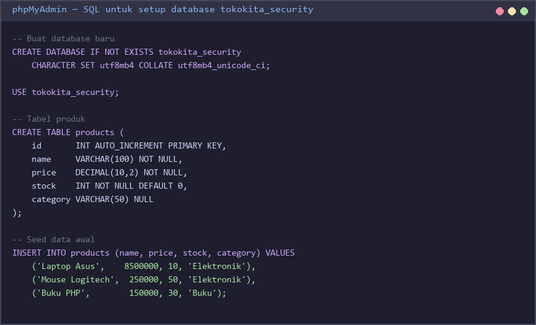

Verifikasi: harus muncul database `tokokita_security` dengan tabel `products` berisi 3 baris data.

### 3. Struktur Folder

Buat folder berikut **di dalam `C:/xampp/htdocs/`** (atau `laragon/www/`):

```
C:/xampp/htdocs/praktek7/
├── api/
│   ├── config.php
│   └── index.php
├── tests/
│   └── security_test.php
├── composer.json
└── phpunit.xml
```

### 4. File `api/config.php`

**Ketik dari gambar:**

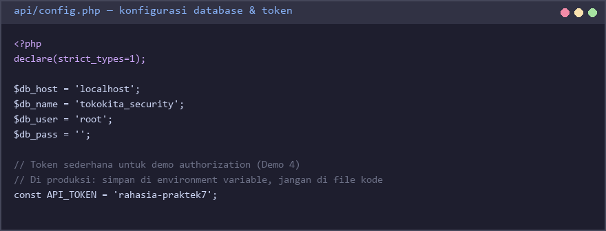

> **Catatan keamanan:** API_TOKEN di file kode hanya untuk pembelajaran. Di produksi, simpan di environment variable, bukan di repo.

---

## 🧪 Demo 1 — SQL Injection pada Parameter GET

**Skenario:** Endpoint `GET ?id=X` membangun query dengan **string concatenation** sehingga input user menjadi bagian dari SQL.

### Langkah 1.1 — Tulis versi rentan

Buat file `api/index.php`. **Ketik kode dari gambar:**

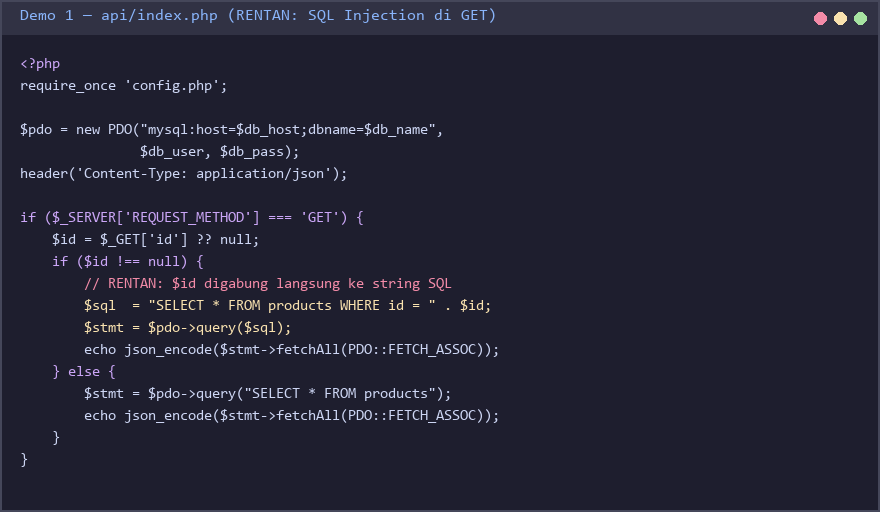

### Langkah 1.2 — Coba serang dengan Postman

Pastikan Apache + MySQL berjalan, lalu kirim 2 request berikut **dari gambar** ke Postman:

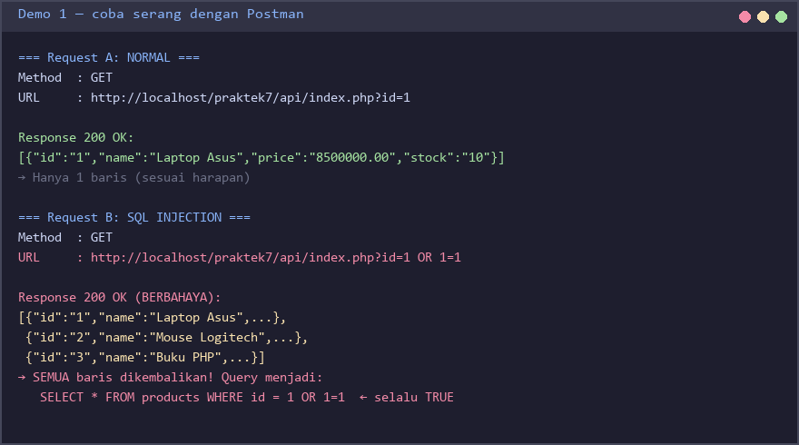

Catat screenshot dari kedua response.

### Langkah 1.3 — Tulis versi aman

Ganti isi `api/index.php` dengan versi aman berikut. **Ketik dari gambar:**

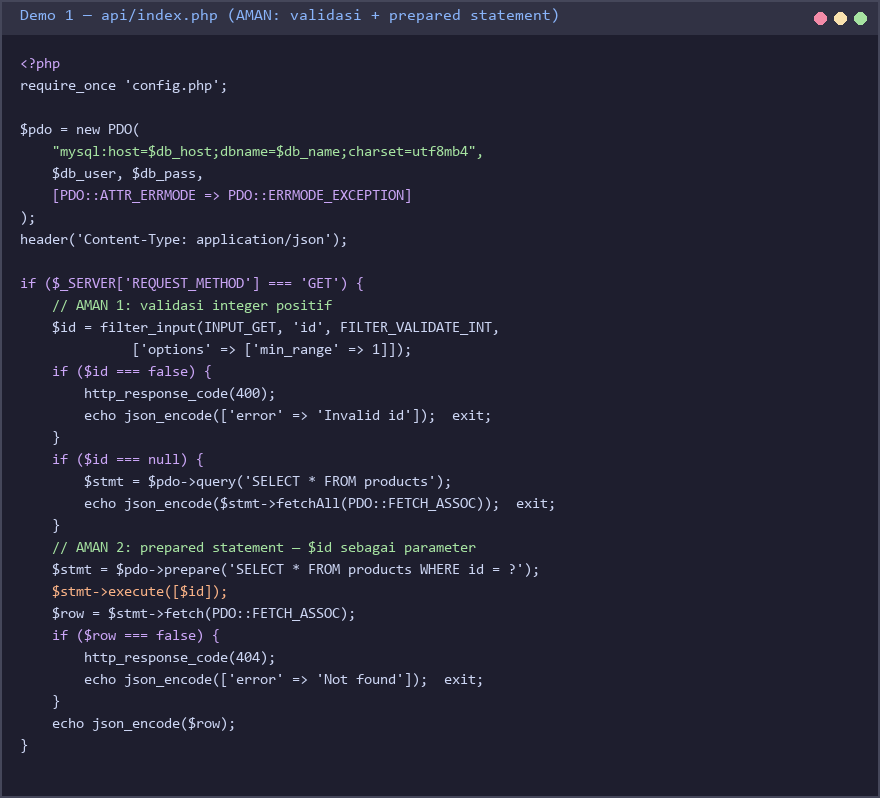

**Dua perbaikan kunci:**
1. `filter_input` dengan `FILTER_VALIDATE_INT` → input non-integer ditolak.
2. `prepare(...)` + `execute([$id])` → `$id` dikirim sebagai *parameter*, bukan digabung ke string SQL.

### Langkah 1.4 — Verifikasi serangan gagal

Kirim ulang Request B dari Langkah 1.2 (`?id=1 OR 1=1`). Sekarang harus dapat **HTTP 400 — Invalid id**.

---

## 🧪 Demo 2 — SQL Injection pada Body POST

**Skenario:** Endpoint POST membangun INSERT dengan string concatenation pada field `name`.

### Langkah 2.1 — Tambah versi rentan untuk POST

Tambahkan blok `elseif POST` di `api/index.php`. **Ketik dari gambar:**

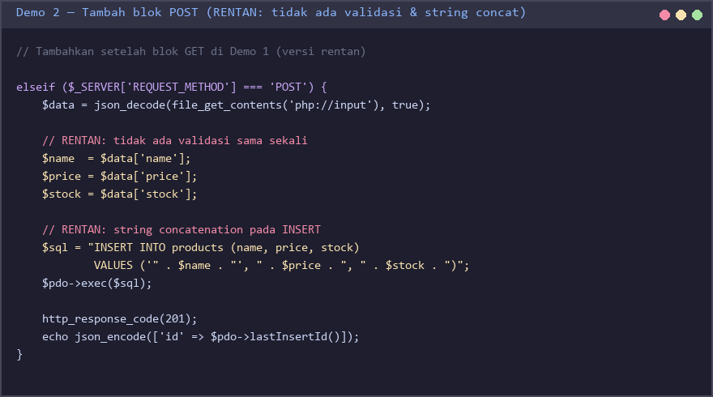

### Langkah 2.2 — Coba serang

**Ketik dari gambar** ke Postman, kirim kedua request:

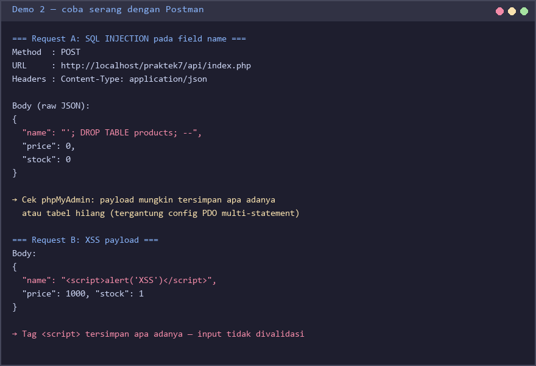

Periksa di phpMyAdmin: lihat apakah payload tersimpan / tabel hilang / data masuk.

### Langkah 2.3 — Tulis versi aman

Ganti blok POST dengan versi berikut. **Ketik dari gambar:**

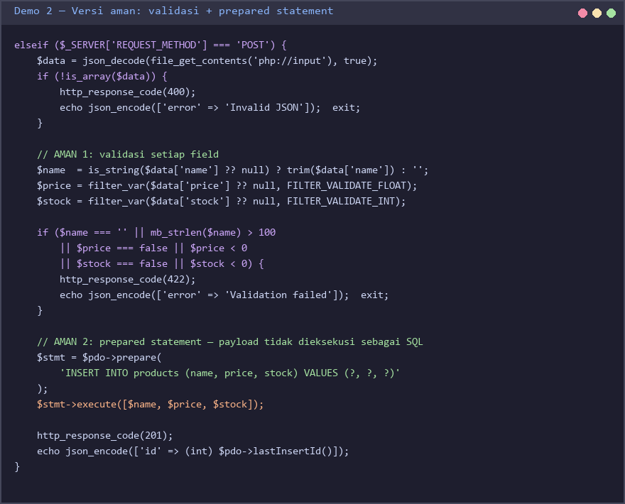

**Tiga perbaikan kunci:**
1. **Validasi setiap field** sebelum dipakai (`is_string`, `mb_strlen`, `FILTER_VALIDATE_FLOAT`, `FILTER_VALIDATE_INT`).
2. **Prepared statement** untuk INSERT — payload SQL hanya jadi *string literal*.
3. **Status 422** untuk data tidak valid, bukan 500.

### Langkah 2.4 — Verifikasi

Ulangi serangan dari Langkah 2.2. Sekarang dapat **HTTP 422** dengan pesan validasi.

---

## 🧪 Demo 3 — Verbose Error & Missing Security Headers

**Skenario:** Default PDO **tidak** melempar exception; error database bocor ke client. Selain itu API tidak mengirim header keamanan dasar.

### Langkah 3.1 — Lihat versi rentan

Bagian setup PDO dan header pada versi rentan terlihat seperti ini:

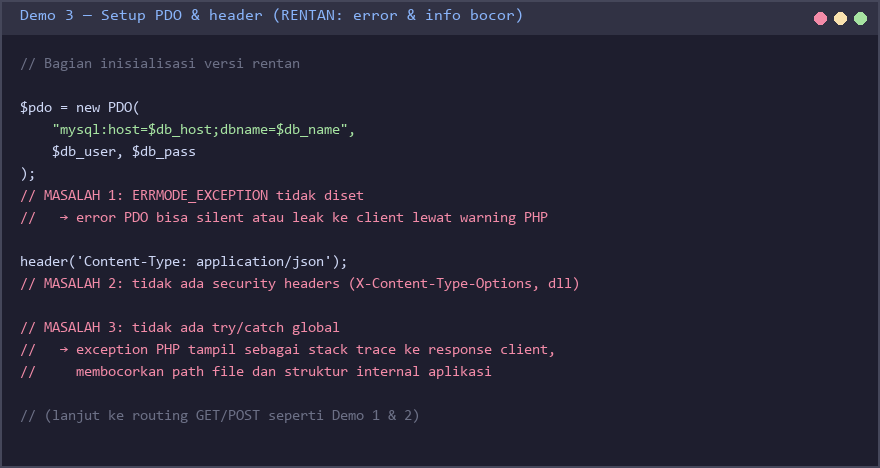

### Langkah 3.2 — Coba picu error

**Ketik dari gambar** request berikut, lalu lihat response body + header di Postman:

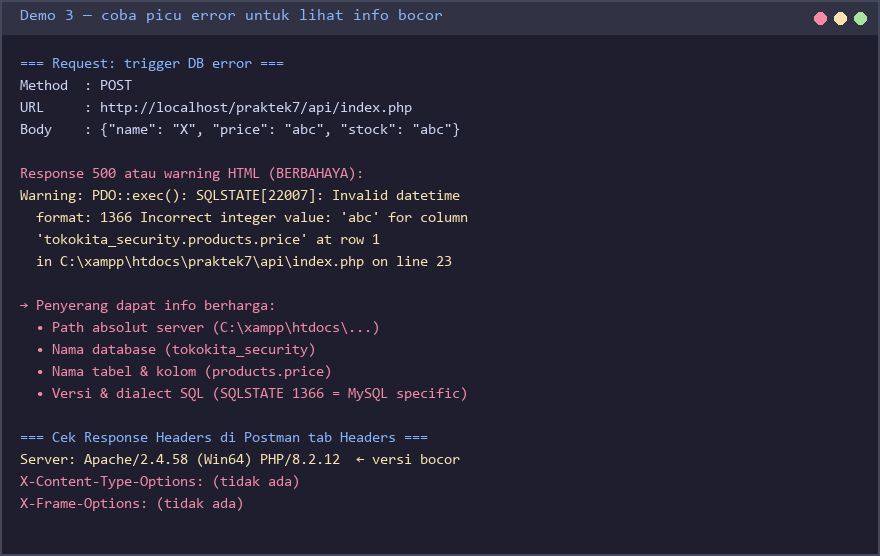

Informasi seperti **path file**, **versi MySQL**, atau **struktur tabel** memudahkan penyerang melakukan reconnaissance.

### Langkah 3.3 — Tulis versi aman

Ganti blok setup PDO dan tambahkan `try/catch` global. **Ketik dari gambar:**

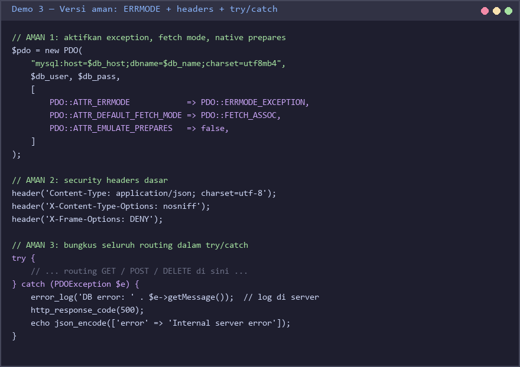

**Empat perbaikan kunci:**
1. `PDO::ATTR_ERRMODE => PDO::ERRMODE_EXCEPTION` → error PDO menjadi exception, bukan diam-diam.
2. `PDO::ATTR_EMULATE_PREPARES => false` → gunakan native prepared statements MySQL.
3. **Security headers**: `X-Content-Type-Options`, `X-Frame-Options`.
4. `try/catch (PDOException)` → pesan generik `Internal server error` ke client, detail di-log dengan `error_log()`.

### Langkah 3.4 — Verifikasi

Ulangi request bermasalah. Response sekarang **HTTP 500** dengan pesan generik. Detail error tetap tersedia di **server log** untuk dosen/developer.

---

## 🧪 Demo 4 — Missing Authorization pada DELETE

**Skenario:** Endpoint DELETE bisa diakses siapa saja.

### Langkah 4.1 — Tulis versi rentan untuk DELETE

Tambahkan blok `elseif DELETE` di `api/index.php`. **Ketik dari gambar:**

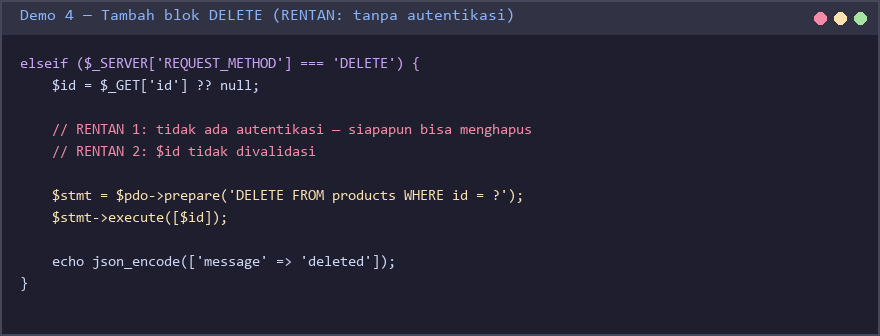

### Langkah 4.2 — Coba serang & rencana verifikasi

**Ketik dari gambar** dan jalankan kedua skenario di Postman:

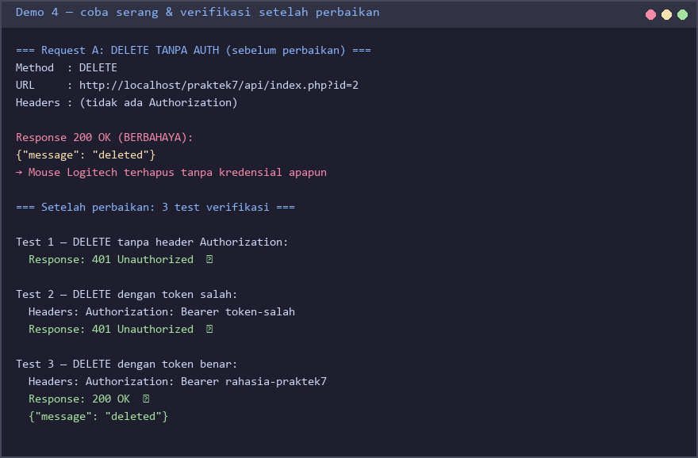

Restore data yang terhapus lewat phpMyAdmin sebelum lanjut.

### Langkah 4.3 — Tulis versi aman

Ganti blok DELETE dengan versi yang memeriksa Bearer token. **Ketik dari gambar:**

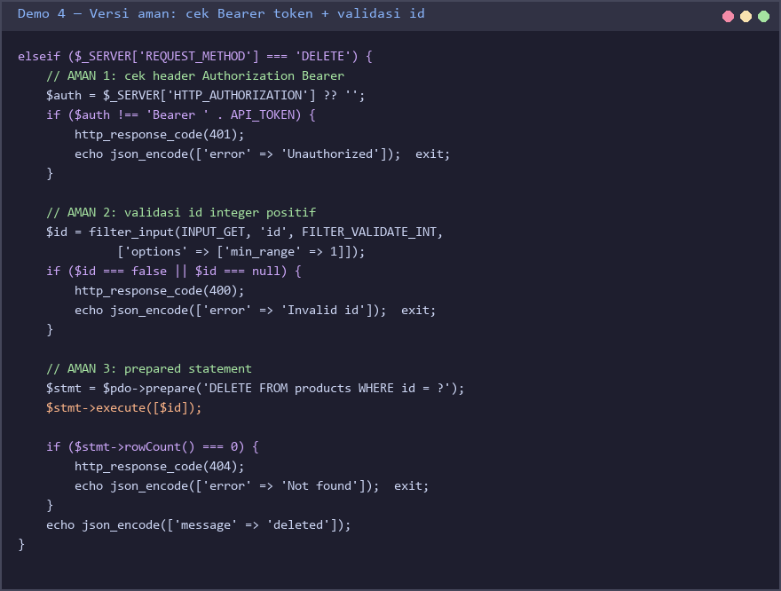

### Langkah 4.4 — Verifikasi

Jalankan 3 test verifikasi yang ada di gambar Demo 4 Serangan (Test 1, 2, 3). Semua harus sesuai status yang diharapkan: 401, 401, 200.

---

## 📝 Soal 1 — Deteksi & Perbaiki Kerentanan (50 poin)

Diberikan kode endpoint **search** untuk produk berikut. Kode ini mengandung **minimal 4 kerentanan keamanan**.

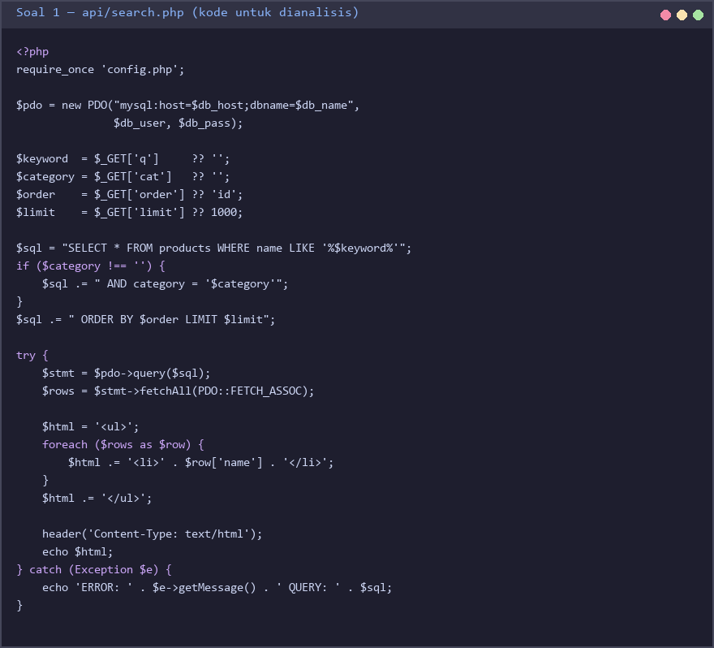

### Tugas 1.A — Identifikasi (20 poin)

Buat file `JAWABAN_SOAL1.md`. Daftarkan **minimal 4 kerentanan** dalam tabel:

| # | Nama Kerentanan | OWASP | Lokasi (baris/blok) | Contoh Payload | Dampak |
|---|---|---|---|---|---|
| 1 | ... | A0x | ... | `...` | ... |
| 2 | ... | ... | ... | ... | ... |
| 3 | ... | ... | ... | ... | ... |
| 4 | ... | ... | ... | ... | ... |

### Tugas 1.B — Buktikan dengan Postman (10 poin)

Pilih **2 kerentanan** dari Tugas 1.A. Untuk masing-masing:
- Kirim request berbahaya dari Postman
- Screenshot request + response yang menunjukkan eksploitasi berhasil
- Tempel di `JAWABAN_SOAL1.md` dengan caption singkat

### Tugas 1.C — Tulis Perbaikan (20 poin)

Tulis ulang seluruh kode endpoint search menjadi **versi aman**. Simpan sebagai `api/search_secure.php`. Versi aman wajib menerapkan:
- Input validation (panjang, tipe, karakter)
- Prepared statement untuk **semua** query
- Error handling yang tidak membocorkan detail
- Pagination dengan batas maksimum
- Output escaping (HTML) untuk mencegah XSS

Verifikasi: ulangi 2 serangan dari Tugas 1.B terhadap `search_secure.php` — semua harus diblokir dengan response yang tepat (400/422/dst).

---

## 📝 Soal 2 — Automated Security Scan dengan OWASP ZAP (50 poin)

Gunakan **OWASP ZAP** untuk men-*scan* API rentan dari Demo 1–4.

### Tugas 2.A — Konfigurasi & Spider (10 poin)

1. Pastikan API rentan masih jalan di `http://localhost/praktek7/api/index.php`.
2. Buka ZAP → tab **Quick Start** → **Manual Explore** → masukkan URL → **Launch Browser**.
3. Browse beberapa endpoint via browser yang dibuka ZAP (GET, POST via simple form, dll).
4. Atau jalankan **Spider** langsung pada `http://localhost/praktek7/`.
5. Screenshot hasil sites tree di ZAP.

### Tugas 2.B — Active Scan (15 poin)


1. Klik kanan node `http://localhost/praktek7/` di sites tree → **Attack → Active Scan** → **Start Scan**.
2. Tunggu sampai progress 100% (2–10 menit).
3. Tab **Alerts** akan terisi temuan.
4. Dokumentasikan **minimal 2 alert dengan Risk HIGH atau MEDIUM** dalam tabel:

| # | Alert | Risk | Confidence | URL | Deskripsi singkat |
|---|---|---|---|---|---|
| 1 | ... | HIGH | ... | ... | ... |
| 2 | ... | ... | ... | ... | ... |

### Tugas 2.C — Perbaiki & Verifikasi (25 poin)

Untuk **2 alert HIGH/MEDIUM** yang dipilih:

1. Tunjukkan **kode bermasalah** (kutip dari file praktek).
2. Tunjukkan **kode perbaikan** (boleh referensi dari Demo 1–4 yang relevan).
3. Jalankan **Active Scan ulang** terhadap kode yang sudah diperbaiki.
4. Screenshot tab Alerts setelah perbaikan — alert tersebut harus **hilang** atau **turun risk level**.

Tulis hasil di `JAWABAN_SOAL2.md` dengan format:

```
## Alert 1: <nama alert>
- Risk: ...
- Kode bermasalah: <snippet>
- Kode perbaikan: <snippet>
- Verifikasi: <screenshot scan ulang>

## Alert 2: ...
```

---

## Yang Dikumpulkan

Buat ZIP berisi:
```
praktek7_<NIM>_<Nama>/
├── api/
│   ├── config.php
│   ├── index.php           ← versi akhir (aman, hasil Demo 1–4)
│   └── search_secure.php   ← jawaban Soal 1.C
├── postman_collection.json ← export koleksi Postman dari Demo + Soal
├── JAWABAN_SOAL1.md
├── JAWABAN_SOAL2.md
└── screenshots/
    ├── demo1_attack_response.png
    ├── demo2_attack_response.png
    ├── demo4_unauthorized.png
    ├── zap_alerts_before.png
    └── zap_alerts_after.png
```

---

## Kriteria Penilaian

| Bagian | Bobot | Indikator |
|---|---|---|
| Demo 1–4 selesai (file `api/index.php` aman) | — | Wajib (gerbang) — tidak dinilai tapi prasyarat soal |
| **Soal 1.A** Identifikasi 4+ kerentanan | 20 |  Kategori OWASP benar, lokasi tepat, payload masuk akal |
| **Soal 1.B** Bukti eksploitasi 2 kerentanan | 10 | Screenshot Postman + caption jelas |
| **Soal 1.C** Implementasi `search_secure.php` | 20 | Prepared statement, validasi, pagination, error generik, output escaping |
| **Soal 2.A** Konfigurasi & Spider ZAP | 10 | Sites tree menunjukkan endpoint praktek7 |
| **Soal 2.B** Dokumentasi 2 alert HIGH/MEDIUM | 15 | Tabel lengkap, deskripsi tepat |
| **Soal 2.C** Perbaikan & verifikasi scan ulang | 25 | Alert berkurang/turun setelah perbaikan, screenshot lengkap |
| **Total** | **100** | |

---

## Lampiran — Cara Verifikasi dengan PHPUnit (opsional)

Bagi yang sudah selesai, jalankan test suite untuk memverifikasi seluruh perbaikan:

```bash
composer install
vendor/bin/phpunit --testdox tests/security_test.php
```

Output yang diharapkan:


