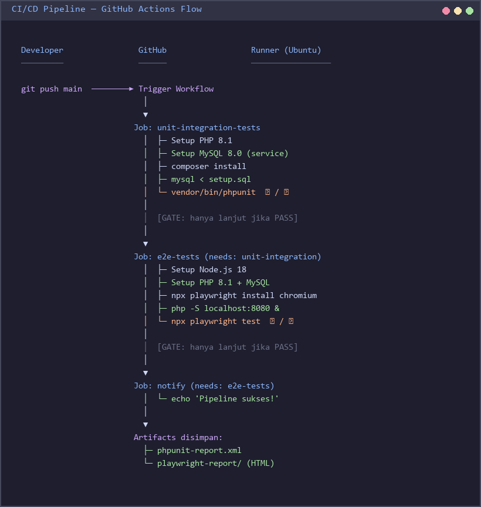
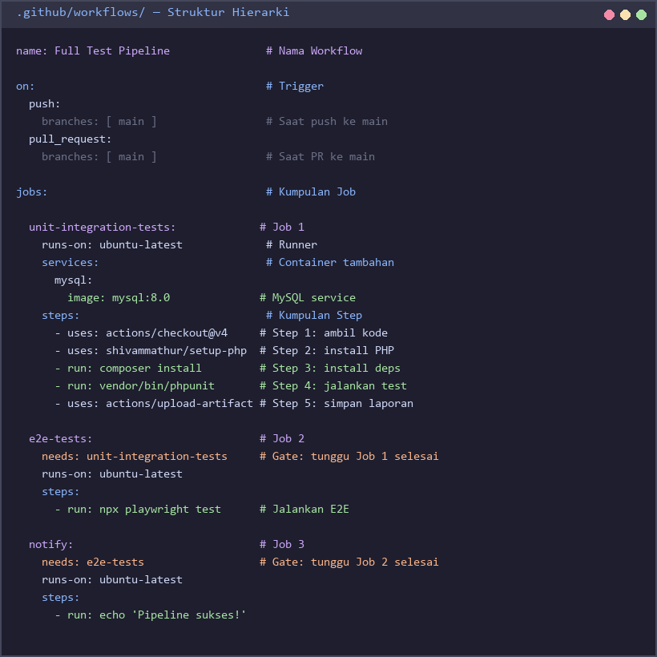
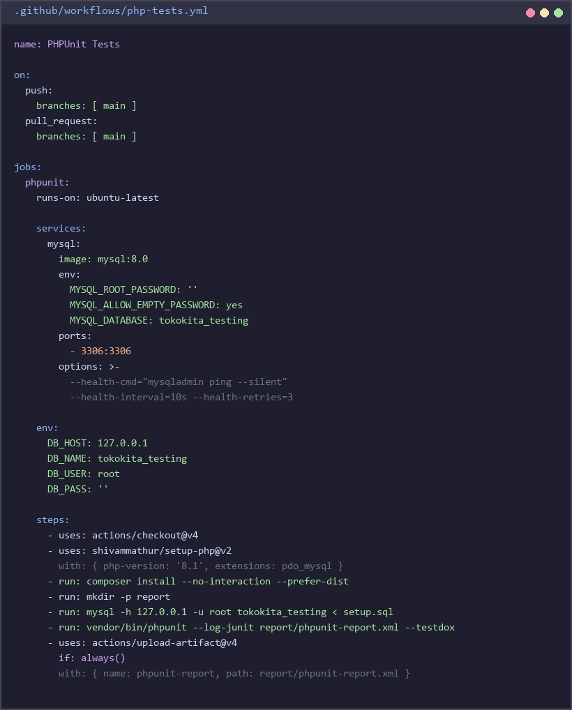
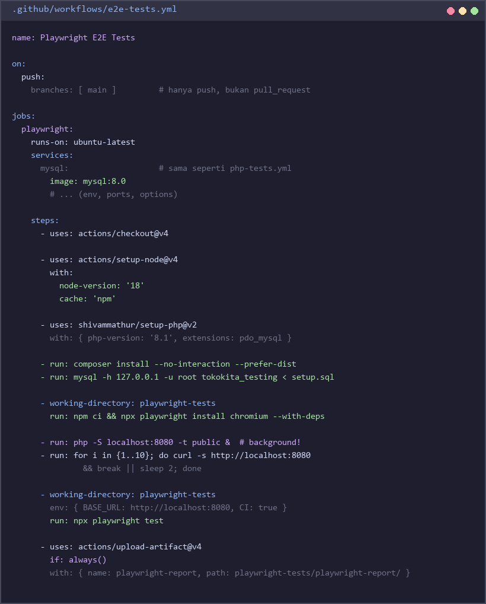
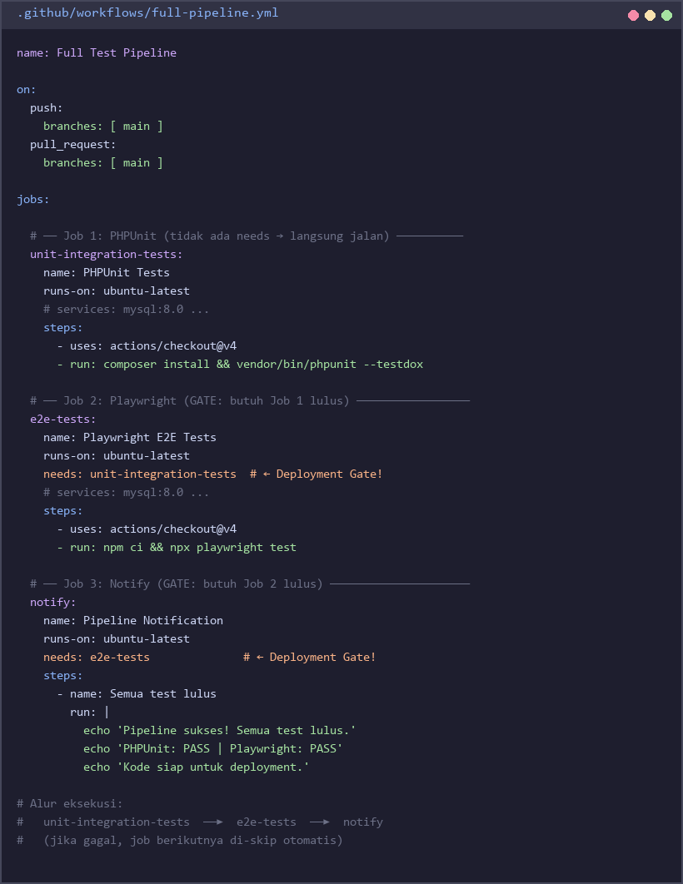
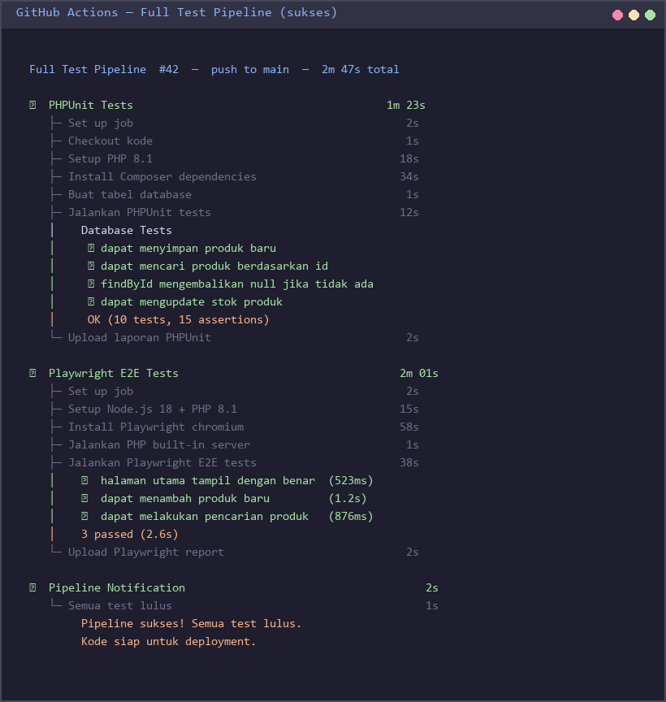

# Praktek 9 — CI/CD & Test Automation Pipeline dengan GitHub Actions

## Tujuan Pembelajaran

Setelah menyelesaikan praktek ini, mahasiswa mampu:
- Memahami konsep CI/CD (Continuous Integration / Continuous Delivery) dan manfaatnya dalam pengembangan perangkat lunak
- Mengkonfigurasi GitHub Actions untuk menjalankan automated test pipeline
- Mengintegrasikan PHPUnit (dari Praktek 2–5) dan Playwright E2E (dari Praktek 8) ke dalam satu pipeline
- Membaca dan menganalisis laporan test (artifacts) yang dihasilkan di CI
- Menerapkan deployment gates menggunakan job dependencies di GitHub Actions

---

## Latar Belakang

### Apa itu CI/CD?

**Continuous Integration (CI)** adalah praktik di mana setiap perubahan kode secara otomatis diintegrasikan ke branch utama, disertai proses build dan pengujian otomatis. Tujuannya adalah menemukan bug secepat mungkin, sebelum kode masuk ke production.

**Continuous Delivery (CD)** adalah kelanjutan dari CI — setelah semua test lulus, kode siap di-deploy kapan saja. Beberapa tim menerapkan **Continuous Deployment** di mana deploy ke production terjadi secara otomatis setelah pipeline hijau.

### Mengapa Mengotomatisasi Testing di CI?

Tanpa CI/CD, developer sering lupa menjalankan test sebelum push, atau environment lokal berbeda dengan server production ("works on my machine"). Dengan CI:

- **Fast feedback**: Test berjalan otomatis begitu push dilakukan — bug ditemukan dalam menit
- **Konsistensi environment**: Semua developer mendapatkan environment yang sama (Ubuntu + MySQL resmi)
- **Mencegah regresi**: Test lama tetap berjalan saat fitur baru ditambahkan
- **Gate sebelum merge**: Pull request tidak bisa di-merge jika ada test yang gagal

### GitHub Actions

GitHub Actions adalah platform CI/CD bawaan GitHub. Konsep utamanya:

| Konsep | Penjelasan |
|--------|-----------|
| **Workflow** | File YAML di `.github/workflows/` yang mendefinisikan seluruh pipeline |
| **Trigger** | Event yang memulai workflow (`push`, `pull_request`, `schedule`) |
| **Job** | Kumpulan steps yang berjalan di satu runner (mesin virtual) |
| **Step** | Satu perintah atau action (contoh: `composer install`) |
| **Runner** | Mesin virtual yang menjalankan job (`ubuntu-latest`, `windows-latest`) |
| **Artifact** | File hasil job (laporan test) yang disimpan untuk diunduh |
| **Service** | Container tambahan (contoh: MySQL) yang berjalan bersama job |

### Bagaimana Semua Test Sebelumnya Bersatu di Pipeline?

Pada praktek-praktek sebelumnya kita sudah membuat berbagai jenis test:

| Praktek | Jenis Test | Tool |
|---------|-----------|------|
| P2 | Integration Testing | PHPUnit |
| P3 | API Testing | PHPUnit + Guzzle |
| P4 | API Testing | Postman / Newman |
| P5 | Database Testing | PHPUnit + MySQL |
| P8 | E2E Testing | Playwright |

Di CI/CD, semua ini dijalankan secara otomatis dan berurutan — jika test awal gagal, test berikutnya tidak dijalankan (pipeline gate).

### Testing Pyramid dalam Konteks CI

```
        /\
       /  \     E2E Tests (P8)
      / E2E\    → Lambat, jarang, coverage luas
     /------\
    /        \  Integration + DB Tests (P2, P3, P5)
   / Integ.  \  → Sedang, sering
  /------------\
 /              \ Unit Tests (P1)
/ Unit Tests    \ → Cepat, banyak, granular
/________________\
```

Dalam pipeline CI, urutan dari bawah ke atas: unit/integration dulu, baru E2E. Jika unit test gagal, tidak perlu buang waktu jalankan E2E.



---

## Persiapan

### 1. Prasyarat

Pastikan sudah tersedia:
- Akun GitHub (gratis, di [github.com](https://github.com))
- Git terinstall di komputer lokal
- Kode PHP dari Praktek 2–5 (terutama Praktek 5 sebagai basis)
- Kode Playwright dari Praktek 8
- PHP 8.1+ dan Composer terinstall lokal (untuk development)
- Node.js 18+ terinstall lokal (untuk Playwright)

### 2. Setup Repository

```bash
# Buat repository baru di GitHub terlebih dahulu, lalu:
git init
git add .
git commit -m "feat: initial project setup dengan PHPUnit dan Playwright tests"
git branch -M main
git remote add origin https://github.com/USERNAME/tokokita-testing.git
git push -u origin main
```

### 3. Struktur Repository

Struktur folder yang diperlukan:

```
project-root/
├── .github/
│   └── workflows/
│       ├── php-tests.yml          ← Soal 1: PHPUnit workflow
│       ├── e2e-tests.yml          ← Soal 2: Playwright workflow
│       └── full-pipeline.yml      ← Soal 3: Combined pipeline
├── src/
│   ├── Database.php               (dari Praktek 5)
│   ├── ProductRepository.php      (dari Praktek 5)
│   └── OrderRepository.php        (dari Praktek 5)
├── tests/
│   ├── BaseTestCase.php
│   ├── ProductRepositoryTest.php
│   └── OrderRepositoryTest.php
├── playwright-tests/
│   ├── package.json               (dari Praktek 8)
│   ├── playwright.config.js
│   └── tests/
│       └── tokokita.spec.js
├── setup.sql                      (script pembuatan tabel)
├── composer.json
├── phpunit.xml
└── README.md
```

---

## Konsep GitHub Actions

### Hierarki Workflow → Job → Step

Sebuah **workflow** terdiri dari satu atau lebih **job**. Setiap **job** berjalan di runner-nya sendiri dan terdiri dari beberapa **step**. Step dieksekusi secara berurutan dalam satu job.

```yaml
name: Nama Workflow        # ← Workflow

on:                        # ← Trigger
  push:
    branches: [main]

jobs:                      # ← Kumpulan Job
  nama-job:                # ← Satu Job
    runs-on: ubuntu-latest
    steps:                 # ← Kumpulan Step
      - name: Checkout kode
        uses: actions/checkout@v4
      - name: Install dependensi
        run: composer install
```

### Trigger yang Umum Digunakan

```yaml
on:
  push:
    branches: [main, develop]      # Setiap push ke branch tersebut
  pull_request:
    branches: [main]               # Setiap PR yang targetnya main
  schedule:
    - cron: '0 2 * * *'           # Setiap hari jam 02:00 UTC
  workflow_dispatch:               # Bisa dipicu manual dari UI GitHub
```

### Services: MySQL untuk Database Test

```yaml
services:
  mysql:
    image: mysql:8.0
    env:
      MYSQL_ROOT_PASSWORD: ''
      MYSQL_ALLOW_EMPTY_PASSWORD: yes
      MYSQL_DATABASE: tokokita_testing
    ports:
      - 3306:3306
    options: >-
      --health-cmd="mysqladmin ping"
      --health-interval=10s
      --health-timeout=5s
      --health-retries=3
```

### Artifacts: Menyimpan Laporan Test

```yaml
- name: Upload laporan PHPUnit
  uses: actions/upload-artifact@v4
  if: always()    # Upload meski test gagal
  with:
    name: phpunit-report
    path: report/phpunit-report.xml
```



---

## Soal

### Soal 1 — PHPUnit CI Workflow (30 poin)

Buat file `.github/workflows/php-tests.yml` yang mengotomatisasi semua PHPUnit test dari Praktek 5 (Database Testing).

**Requirement workflow:**
- Trigger: `push` dan `pull_request` ke branch `main`
- Runner: `ubuntu-latest`
- Setup PHP 8.1 dengan ekstensi `pdo_mysql`
- Setup MySQL 8.0 sebagai service container
- Environment variable database: `DB_HOST=127.0.0.1`, `DB_NAME=tokokita_testing`, `DB_USER=root`, `DB_PASS=` (kosong)
- Steps yang harus ada:
  1. Checkout kode
  2. Setup PHP 8.1
  3. Install Composer dependencies
  4. Tunggu MySQL siap (health check)
  5. Buat tabel database dari `setup.sql`
  6. Jalankan `vendor/bin/phpunit --log-junit report/phpunit-report.xml`
  7. Upload laporan XML sebagai artifact

**Isi file `.github/workflows/php-tests.yml`:**

```yaml
name: PHPUnit Tests

on:
  push:
    branches: [ main ]
  pull_request:
    branches: [ main ]

jobs:
  phpunit:
    runs-on: ubuntu-latest

    services:
      mysql:
        image: mysql:8.0
        env:
          MYSQL_ROOT_PASSWORD: ''
          MYSQL_ALLOW_EMPTY_PASSWORD: yes
          MYSQL_DATABASE: tokokita_testing
        ports:
          - 3306:3306
        options: >-
          --health-cmd="mysqladmin ping --silent"
          --health-interval=10s
          --health-timeout=5s
          --health-retries=3

    env:
      DB_HOST: 127.0.0.1
      DB_NAME: tokokita_testing
      DB_USER: root
      DB_PASS: ''
      DB_PORT: 3306

    steps:
      - name: Checkout kode
        uses: actions/checkout@v4

      - name: Setup PHP 8.1
        uses: shivammathur/setup-php@v2
        with:
          php-version: '8.1'
          extensions: pdo_mysql
          coverage: none

      - name: Install Composer dependencies
        run: composer install --no-interaction --prefer-dist

      - name: Buat direktori laporan
        run: mkdir -p report

      - name: Buat tabel database
        run: mysql -h 127.0.0.1 -u root tokokita_testing < setup.sql

      - name: Jalankan PHPUnit tests
        run: vendor/bin/phpunit --log-junit report/phpunit-report.xml --testdox

      - name: Upload laporan PHPUnit
        uses: actions/upload-artifact@v4
        if: always()
        with:
          name: phpunit-report
          path: report/phpunit-report.xml
          retention-days: 7
```

> Simpan file di `.github/workflows/php-tests.yml` di root repository Anda, lalu commit dan push. Buka tab **Actions** di GitHub untuk melihat workflow berjalan.



---

### Soal 2 — Playwright E2E CI Workflow (30 poin)

Buat file `.github/workflows/e2e-tests.yml` yang menjalankan test Playwright dari Praktek 8 di environment CI.

**Requirement workflow:**
- Trigger: `push` ke branch `main` saja (bukan pull request)
- Runner: `ubuntu-latest`
- Setup Node.js 18
- Setup PHP 8.1 + MySQL service (sama seperti Soal 1)
- Install Playwright browsers (`chromium` saja untuk CI)
- Jalankan PHP built-in server di background: `php -S localhost:8080 -t public &`
- Tunggu server siap menggunakan `curl` retry loop
- Jalankan `npx playwright test`
- Upload Playwright HTML report sebagai artifact

**Isi file `.github/workflows/e2e-tests.yml`:**

```yaml
name: Playwright E2E Tests

on:
  push:
    branches: [ main ]

jobs:
  playwright:
    runs-on: ubuntu-latest

    services:
      mysql:
        image: mysql:8.0
        env:
          MYSQL_ROOT_PASSWORD: ''
          MYSQL_ALLOW_EMPTY_PASSWORD: yes
          MYSQL_DATABASE: tokokita_testing
        ports:
          - 3306:3306
        options: >-
          --health-cmd="mysqladmin ping --silent"
          --health-interval=10s
          --health-timeout=5s
          --health-retries=3

    env:
      DB_HOST: 127.0.0.1
      DB_NAME: tokokita_testing
      DB_USER: root
      DB_PASS: ''
      DB_PORT: 3306

    steps:
      - name: Checkout kode
        uses: actions/checkout@v4

      - name: Setup Node.js 18
        uses: actions/setup-node@v4
        with:
          node-version: '18'
          cache: 'npm'
          cache-dependency-path: playwright-tests/package-lock.json

      - name: Setup PHP 8.1
        uses: shivammathur/setup-php@v2
        with:
          php-version: '8.1'
          extensions: pdo_mysql
          coverage: none

      - name: Install Composer dependencies
        run: composer install --no-interaction --prefer-dist

      - name: Buat tabel database
        run: mysql -h 127.0.0.1 -u root tokokita_testing < setup.sql

      - name: Install Playwright dan browsers
        working-directory: playwright-tests
        run: |
          npm ci
          npx playwright install chromium --with-deps

      - name: Jalankan PHP built-in server
        run: php -S localhost:8080 -t public &

      - name: Tunggu server siap
        run: |
          for i in {1..10}; do
            curl -s http://localhost:8080 && break || sleep 2
          done

      - name: Jalankan Playwright E2E tests
        working-directory: playwright-tests
        env:
          BASE_URL: http://localhost:8080
          CI: true
        run: npx playwright test

      - name: Upload Playwright HTML report
        uses: actions/upload-artifact@v4
        if: always()
        with:
          name: playwright-report
          path: playwright-tests/playwright-report/
          retention-days: 7
```

> Pastikan `playwright.config.js` membaca `BASE_URL` dari environment variable agar URL dapat dikonfigurasi di CI.



---

### Soal 3 — Full Pipeline dengan Jobs yang Bergantung (20 poin)

Buat file `.github/workflows/full-pipeline.yml` yang menggabungkan PHPUnit dan Playwright dalam satu pipeline dengan **3 jobs berurutan** menggunakan `needs`:

```
unit-integration-tests  →  e2e-tests  →  notify
```

Dengan struktur ini, jika `unit-integration-tests` gagal, `e2e-tests` tidak akan dijalankan. Ini disebut **deployment gate** — test berikutnya hanya berjalan jika test sebelumnya berhasil.

**Requirement:**

Job 1 — `unit-integration-tests`:
- Sama persis dengan Soal 1 (PHPUnit + MySQL)

Job 2 — `e2e-tests`:
- `needs: unit-integration-tests`
- Sama persis dengan Soal 2 (Playwright)

Job 3 — `notify`:
- `needs: e2e-tests`
- Satu step sederhana: `echo "Pipeline sukses! Semua test lulus."`

**Isi file `.github/workflows/full-pipeline.yml`:**

```yaml
name: Full Test Pipeline

on:
  push:
    branches: [ main ]
  pull_request:
    branches: [ main ]

jobs:
  unit-integration-tests:
    name: PHPUnit Tests
    runs-on: ubuntu-latest

    services:
      mysql:
        image: mysql:8.0
        env:
          MYSQL_ROOT_PASSWORD: ''
          MYSQL_ALLOW_EMPTY_PASSWORD: yes
          MYSQL_DATABASE: tokokita_testing
        ports:
          - 3306:3306
        options: >-
          --health-cmd="mysqladmin ping --silent"
          --health-interval=10s
          --health-timeout=5s
          --health-retries=3

    env:
      DB_HOST: 127.0.0.1
      DB_NAME: tokokita_testing
      DB_USER: root
      DB_PASS: ''
      DB_PORT: 3306

    steps:
      - uses: actions/checkout@v4
      - uses: shivammathur/setup-php@v2
        with:
          php-version: '8.1'
          extensions: pdo_mysql
          coverage: none
      - run: composer install --no-interaction --prefer-dist
      - run: mkdir -p report
      - run: mysql -h 127.0.0.1 -u root tokokita_testing < setup.sql
      - run: vendor/bin/phpunit --log-junit report/phpunit-report.xml --testdox
      - uses: actions/upload-artifact@v4
        if: always()
        with:
          name: phpunit-report
          path: report/phpunit-report.xml

  e2e-tests:
    name: Playwright E2E Tests
    runs-on: ubuntu-latest
    needs: unit-integration-tests      # ← Gate: hanya jalan jika PHPUnit lulus

    services:
      mysql:
        image: mysql:8.0
        env:
          MYSQL_ROOT_PASSWORD: ''
          MYSQL_ALLOW_EMPTY_PASSWORD: yes
          MYSQL_DATABASE: tokokita_testing
        ports:
          - 3306:3306
        options: >-
          --health-cmd="mysqladmin ping --silent"
          --health-interval=10s
          --health-timeout=5s
          --health-retries=3

    env:
      DB_HOST: 127.0.0.1
      DB_NAME: tokokita_testing
      DB_USER: root
      DB_PASS: ''
      DB_PORT: 3306

    steps:
      - uses: actions/checkout@v4
      - uses: actions/setup-node@v4
        with:
          node-version: '18'
          cache: 'npm'
          cache-dependency-path: playwright-tests/package-lock.json
      - uses: shivammathur/setup-php@v2
        with:
          php-version: '8.1'
          extensions: pdo_mysql
          coverage: none
      - run: composer install --no-interaction --prefer-dist
      - run: mysql -h 127.0.0.1 -u root tokokita_testing < setup.sql
      - working-directory: playwright-tests
        run: |
          npm ci
          npx playwright install chromium --with-deps
      - run: php -S localhost:8080 -t public &
      - run: |
          for i in {1..10}; do
            curl -s http://localhost:8080 && break || sleep 2
          done
      - working-directory: playwright-tests
        env:
          BASE_URL: http://localhost:8080
          CI: true
        run: npx playwright test
      - uses: actions/upload-artifact@v4
        if: always()
        with:
          name: playwright-report
          path: playwright-tests/playwright-report/

  notify:
    name: Pipeline Notification
    runs-on: ubuntu-latest
    needs: e2e-tests                   # ← Gate: hanya jalan jika E2E lulus

    steps:
      - name: Semua test lulus
        run: |
          echo "============================================"
          echo "  Pipeline sukses! Semua test lulus.       "
          echo "  PHPUnit  : PASS                          "
          echo "  Playwright: PASS                         "
          echo "  Kode siap untuk deployment.              "
          echo "============================================"
```



---

### Soal 4 — Analisis Pipeline (10 poin)

Setelah workflow berhasil berjalan di GitHub Actions, lakukan analisis berikut:

**a) Tambahkan Badge di README.md**

GitHub Actions menyediakan badge status yang bisa ditampilkan di README. Format URL badge:

```markdown


```

Ganti `USERNAME` dan `REPO` dengan nama GitHub Anda.

**b) Screenshot GitHub Actions UI**

Ambil screenshot halaman Actions di GitHub yang menunjukkan pipeline berjalan hijau (semua job centang hijau). Simpan sebagai `images/p9_pipeline_success.png`.

**c) Dokumentasi Waktu Eksekusi**

Isi tabel berikut berdasarkan hasil aktual dari GitHub Actions UI:

| Job | Waktu Eksekusi | Keterangan |
|-----|---------------|-----------|
| unit-integration-tests | ___ detik | Termasuk setup MySQL dan composer install |
| e2e-tests | ___ detik | Termasuk install Playwright browsers |
| notify | ___ detik | Hanya echo, sangat cepat |

Jawab: Job mana yang paling lambat dan mengapa?



---

### Soal 5 — Refleksi (10 poin)

Jawab pertanyaan berikut dalam file `REFLEKSI.md` di root repository:

**Pertanyaan 1:**
Apa yang terjadi jika salah satu test PHPUnit gagal? Apakah job `e2e-tests` di `full-pipeline.yml` tetap dijalankan? Jelaskan mengapa perilaku ini penting dalam CI/CD!

**Pertanyaan 2:**
Jelaskan dengan kata-kata Anda sendiri: mengapa CI/CD dapat mencegah masalah "works on my machine"? Apa yang membuat environment GitHub Actions lebih dapat dipercaya dari environment developer lokal?

**Pertanyaan 3:**
Apa yang dimaksud dengan **deployment gate** dalam konteks `full-pipeline.yml` yang Anda buat? Berikan contoh nyata: dalam skenario production, deployment gate apa yang sebaiknya ditambahkan setelah E2E test?

---

## Contoh Output GitHub Actions

Setelah semua workflow dikonfigurasi dengan benar, GitHub Actions UI akan menampilkan status tiap job:


```
Full Test Pipeline
├── PHPUnit Tests          ✓ (1m 23s)
├── Playwright E2E Tests   ✓ (2m 47s)
└── Pipeline Notification  ✓ (0m 02s)

All jobs passed. Artifacts:
  - phpunit-report (phpunit-report.xml)
  - playwright-report (index.html)
```

---

## Kriteria Penilaian

| Soal | Bobot | Kriteria |
|------|-------|----------|
| Soal 1 — PHPUnit CI Workflow | 30 poin | File YAML valid, MySQL service benar, PHPUnit berjalan, artifact diupload |
| Soal 2 — Playwright E2E CI Workflow | 30 poin | Node.js setup, PHP server berjalan, Playwright berjalan headless, report diupload |
| Soal 3 — Full Pipeline dengan Job Dependencies | 20 poin | `needs` digunakan dengan benar, 3 job berurutan, pipeline gate berfungsi |
| Soal 4 — Analisis Pipeline | 10 poin | Badge di README, screenshot pipeline hijau, tabel waktu eksekusi diisi |
| Soal 5 — Refleksi | 10 poin | Jawaban tepat, menunjukkan pemahaman konsep CI/CD dan deployment gate |

**Total: 100 poin**
