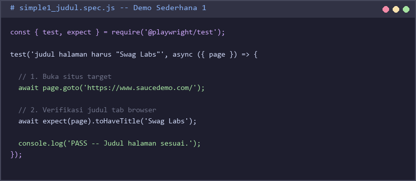
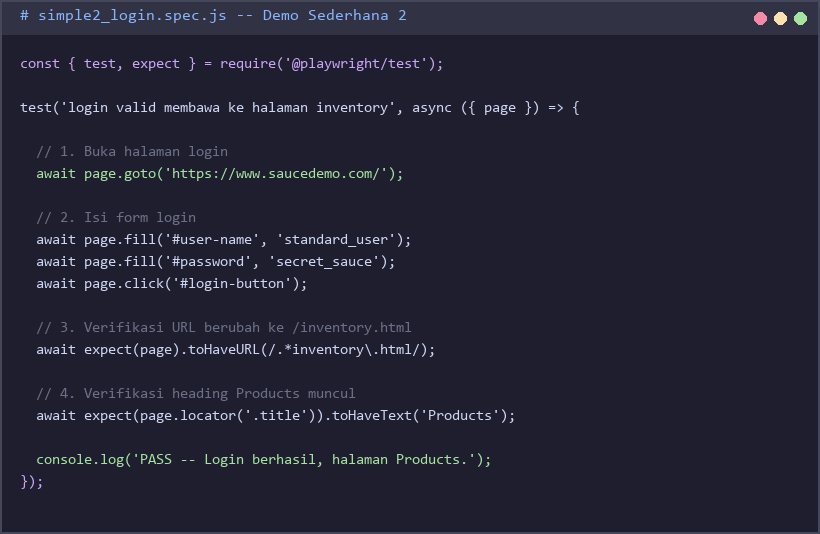

# Praktek 9 — End-to-End Testing dengan Playwright

## Tujuan Pembelajaran

Setelah menyelesaikan praktek ini, mahasiswa mampu:
- Memahami konsep **End-to-End (E2E) testing** dan perbedaannya dengan unit test
- Menginstal dan mengkonfigurasi **Playwright** untuk otomasi browser
- Menulis test yang mensimulasikan alur pengguna: buka URL, isi form, klik tombol, verifikasi hasil
- Membandingkan Playwright (JavaScript) vs Selenium (Python) pada situs yang sama
- Menerapkan **multi-browser testing** dengan satu konfigurasi

---

## Latar Belakang

### Apa itu End-to-End Testing?

E2E testing menguji aplikasi **dari sudut pandang pengguna**. Browser dibuka secara otomatis, tombol diklik, form diisi, dan hasilnya diverifikasi — persis seperti pengguna nyata.

### Testing Pyramid

```
        ┌───────────┐
        │   E2E     │  ← Sedikit, lambat, paling realistis
        ├───────────┤
        │    API    │  ← Sedang, menguji kontrak endpoint
        ├───────────┤
        │   Unit    │  ← Banyak, cepat, terisolasi
        └───────────┘
```

### Playwright vs Selenium — Situs yang Sama

Di Praktek 8 kita menulis test Selenium di Python untuk **saucedemo.com**. Di praktek ini kita menulis test Playwright di JavaScript untuk **situs yang sama**. Perhatikan betapa lebih ringkas kodenya.

| Fitur | Selenium (Praktek 8) | Playwright (Praktek 9) |
|-------|---------------------|------------------------|
| Bahasa | Python | JavaScript |
| Auto-wait | Tidak — perlu `WebDriverWait` | **Ya** — otomatis |
| Multi-browser | Driver terpisah per browser | Built-in (Chromium, Firefox, WebKit) |
| Instalasi browser | Manual (chromedriver) | `npx playwright install` |
| Tutup browser | `driver.quit()` di `finally` | Otomatis setelah setiap test |
| Assert elemen | `assert element.text == 'teks'` | `await expect(locator).toHaveText('teks')` |

### Arsitektur Playwright


---

## Persiapan

### 1. Prasyarat: Node.js

Playwright membutuhkan Node.js versi 18 atau lebih baru:

```bash
node --version   # harus >= v18.0.0
npm --version    # harus >= 8.0.0
```

Jika belum terinstall: unduh dari **https://nodejs.org** pilih versi **LTS**.

**Winget (Windows 11):**
```bash
winget install OpenJS.NodeJS.LTS
```

### 2. Buat Folder Proyek

```bash
mkdir praktek9_e2e
cd praktek9_e2e
```

### 3. Inisialisasi Playwright

```bash
npm init playwright@latest
```

Jawab seperti ini:

```
Where to put your end-to-end tests? › tests
Add a GitHub Actions workflow?       › n
Install Playwright browsers?         › y
```

Proses ini akan:
1. Membuat `package.json` dan `playwright.config.js`
2. Mengunduh browser binaries Chromium, Firefox, WebKit (±250 MB)

Tampilan `package.json` yang terbentuk:


### 4. Konfigurasi `playwright.config.js`

Buka `playwright.config.js` dan ubah bagian `use:` agar mengarah ke saucedemo:

```javascript
use: {
  baseURL: 'https://www.saucedemo.com',
  screenshot: 'only-on-failure',
},
```

Dengan `baseURL`, cukup tulis `page.goto('/')` di setiap test.

Tampilan `playwright.config.js` setelah diedit:


### 5. Verifikasi Instalasi

Hapus file contoh bawaan, buat test sederhana, dan jalankan:

```bash
del tests\example.spec.js     # Windows
rm tests/example.spec.js      # Mac/Linux
```

```bash
npx playwright test --project=chromium
```

Jika muncul output `0 passed` (karena folder tests kosong) — instalasi berhasil dan Playwright siap dipakai.

---

## Konsep Playwright

### Struktur Test Dasar

```javascript
const { test, expect } = require('@playwright/test');

test('nama test yang deskriptif', async ({ page }) => {
  // Arrange: buka halaman
  await page.goto('/');

  // Act: lakukan aksi
  await page.fill('#user-name', 'standard_user');
  await page.click('#login-button');

  // Assert: verifikasi hasil
  await expect(page).toHaveURL(/.*inventory\.html/);
});
```

### Auto-Wait — Perbedaan Utama dari Selenium

Playwright menunggu **secara otomatis** sampai elemen siap sebelum berinteraksi. Tidak perlu `WebDriverWait`:

```
Selenium (Praktek 8):                    Playwright (Praktek 9):
──────────────────────────────           ────────────────────────────
wait = WebDriverWait(driver, 10)         await page.click('#login-button');
wait.until(EC.element_to_be_            // Playwright otomatis tunggu
  clickable((By.ID, "login-button")))   // sampai tombol bisa diklik
driver.find_element(By.ID,
  "login-button").click()
```

### Navigasi dan Interaksi

| Method | Kegunaan | Contoh |
|--------|----------|--------|
| `page.goto('/')` | Buka halaman | `await page.goto('/')` |
| `page.fill(sel, text)` | Isi input field | `await page.fill('#user-name', 'standard_user')` |
| `page.click(sel)` | Klik elemen | `await page.click('#login-button')` |
| `page.selectOption(sel, val)` | Pilih dropdown | `await page.selectOption('.sort', 'az')` |
| `page.locator(sel)` | Referensi ke elemen | `page.locator('.inventory_item_name')` |

### Assertions

| Assertion | Kegunaan |
|-----------|----------|
| `expect(page).toHaveTitle('Swag Labs')` | Cek judul tab browser |
| `expect(page).toHaveURL(/.*inventory\.html/)` | Cek URL dengan regex |
| `expect(locator).toBeVisible()` | Elemen tampak |
| `expect(locator).not.toBeVisible()` | Elemen tidak tampak |
| `expect(locator).toHaveText('teks')` | Teks persis |
| `expect(locator).toContainText('teks')` | Mengandung teks |
| `expect(locator).toHaveCount(n)` | Jumlah elemen |

---

## Demo Sederhana 1 — Cek Judul Halaman

Test paling dasar: buka saucedemo.com dan verifikasi judul tab browser.

Buat file `tests/simple1_judul.spec.js`. **Ketik seluruh kode dari gambar berikut** (jangan copy-paste):



Jalankan dengan browser terlihat:

```bash
npx playwright test tests/simple1_judul.spec.js --headed --project=chromium
```

Output yang diharapkan:

```
Running 1 test using 1 worker
  ✓  tests/simple1_judul.spec.js:3 › judul halaman harus "Swag Labs"  (1.3s)
1 passed (2.1s)
```

**Bandingkan dengan Praktek 8 Selenium:**
```python
# Selenium (Python) — 12 baris
driver = webdriver.Chrome(options=options)
try:
    driver.get("https://www.saucedemo.com/")
    assert driver.title == "Swag Labs"
finally:
    driver.quit()
```
```javascript
// Playwright (JS) — 5 baris
await page.goto('https://www.saucedemo.com/');
await expect(page).toHaveTitle('Swag Labs');
```

---

## Demo Sederhana 2 — Login dan Verifikasi Halaman Inventory

Test interaksi form: isi username + password, klik login, verifikasi URL dan heading.

Buat file `tests/simple2_login.spec.js`. **Ketik seluruh kode dari gambar berikut:**



Jalankan:

```bash
npx playwright test tests/simple2_login.spec.js --headed --project=chromium
```

Output yang diharapkan:

```
Running 1 test using 1 worker
  ✓  tests/simple2_login.spec.js:3 › login valid membawa ke halaman inventory  (2.1s)
1 passed (2.9s)
```

**Poin kunci:**
- `page.fill()` langsung mengisi field — tidak perlu `find_element().send_keys()`
- `expect(page).toHaveURL(/.*inventory\.html/)` menggunakan **regex** untuk cek URL
- Tidak ada `WebDriverWait` — Playwright auto-wait sampai `.title` elemen siap

---

## Demo Advanced — Alur Pembelian End-to-End

Test alur lengkap: login → tambah produk → checkout → konfirmasi. Skenario yang sama dengan Demo Advanced di Praktek 8, tapi ditulis dalam Playwright.

Buat file `tests/advanced_purchase_flow.spec.js`. Kode ini boleh di-copy:

```javascript
const { test, expect } = require('@playwright/test');

const BASE_URL = 'https://www.saucedemo.com/';

async function login(page) {
  await page.goto(BASE_URL);
  await page.fill('#user-name', 'standard_user');
  await page.fill('#password', 'secret_sauce');
  await page.click('#login-button');
  await expect(page).toHaveURL(/.*inventory\.html/);
}

// ── Test 1: Pembelian dua produk end-to-end ──────────────────────────────────

test('pembelian dua produk end-to-end', async ({ page }) => {
  await login(page);

  // Tambah 2 produk ke cart
  await page.click('#add-to-cart-sauce-labs-backpack');
  await page.click('#add-to-cart-sauce-labs-bike-light');
  await expect(page.locator('.shopping_cart_badge')).toHaveText('2');

  // Buka cart dan verifikasi 2 item
  await page.click('.shopping_cart_link');
  await expect(page).toHaveURL(/.*cart\.html/);
  await expect(page.locator('.cart_item')).toHaveCount(2);

  // Checkout — isi data pengiriman
  await page.click('#checkout');
  await page.fill('#first-name', 'Budi');
  await page.fill('#last-name', 'Santoso');
  await page.fill('#postal-code', '60285');
  await page.click('#continue');

  // Verifikasi ringkasan total
  await expect(page).toHaveURL(/.*checkout-step-two\.html/);
  await expect(page.locator('.summary_total_label')).toContainText('Total:');

  // Selesaikan pembelian
  await page.click('#finish');
  await expect(page.locator('.complete-header')).toHaveText('Thank you for your order!');
});

// ── Test 2: Logout dan verifikasi kembali ke halaman login ───────────────────

test('logout membawa kembali ke halaman login', async ({ page }) => {
  await login(page);

  await page.click('#react-burger-menu-btn');
  await page.click('#logout_sidebar_link');

  await expect(page).toHaveURL(BASE_URL);
  await expect(page.locator('#login-button')).toBeVisible();
});

// ── Test 3: Sortir produk harga rendah ke tinggi ─────────────────────────────

test('sortir produk harga rendah ke tinggi', async ({ page }) => {
  await login(page);

  await page.selectOption('.product_sort_container', 'lohi');

  const prices = await page.locator('.inventory_item_price').evaluateAll(
    els => els.map(el => parseFloat(el.textContent.replace('$', '')))
  );

  expect(prices).toEqual([...prices].sort((a, b) => a - b));
});
```

Jalankan:

```bash
npx playwright test tests/advanced_purchase_flow.spec.js --headed
```

---

## Cara Menjalankan Test

```bash
# Jalankan semua test (headless)
npx playwright test

# Jalankan dengan browser terlihat
npx playwright test --headed

# Jalankan satu file
npx playwright test tests/simple2_login.spec.js

# Jalankan di browser tertentu
npx playwright test --project=firefox

# Buka HTML report interaktif
npx playwright show-report

# Mode debug — Playwright Inspector
npx playwright test --debug
```

Contoh output CLI:


---

## Soal

### Soal 1 — Setup Playwright (20 poin)

**Langkah:**

a) Buat folder `praktek9_e2e/` dan inisialisasi Playwright dengan `npm init playwright@latest`.

b) Konfigurasi `playwright.config.js`:
- `baseURL: 'https://www.saucedemo.com'`
- `screenshot: 'only-on-failure'`

c) Tampilkan isi `package.json` yang terbentuk:


d) Tampilkan isi `playwright.config.js` setelah dikonfigurasi:


**Yang dikumpulkan:** Screenshot terminal saat instalasi berhasil dan screenshot kedua file konfigurasi.

---

### Soal 2 — Login Negatif (30 poin)

Buat file `tests/soal2_login_negatif.spec.js` dengan **3 test** berikut:

```javascript
const { test, expect } = require('@playwright/test');

test.describe('Login Negatif', () => {

  test('username kosong tampilkan pesan error', async ({ page }) => {
    await page.goto('/');
    // TODO: isi password saja, biarkan username kosong
    // TODO: klik login
    // TODO: verifikasi pesan error muncul dan mengandung 'Username is required'
    // TODO: verifikasi URL tidak berubah ke /inventory.html
  });

  test('password kosong tampilkan pesan error', async ({ page }) => {
    await page.goto('/');
    // TODO: isi username saja, biarkan password kosong
    // TODO: klik login
    // TODO: verifikasi pesan error mengandung 'Password is required'
  });

  test('akun terkunci tampilkan pesan locked out', async ({ page }) => {
    await page.goto('/');
    // TODO: login dengan username 'locked_out_user', password 'secret_sauce'
    // TODO: verifikasi pesan error mengandung kata 'locked out'
  });

});
```

**Petunjuk:**
- Locator pesan error: `page.locator('[data-test="error"]')`
- Gunakan `toContainText()` bukan `toHaveText()` untuk substring match
- Untuk cek URL bukan /inventory: `expect(page).not.toHaveURL(/.*inventory\.html/)`

**Kriteria Soal 2:**
- Test username kosong: lulus + assertion error + assertion URL (10 poin)
- Test password kosong: lulus + assertion error (10 poin)
- Test locked out: lulus + assertion mengandung 'locked out' (10 poin)

---

### Soal 3 — Filter dan Sortir Inventory (30 poin)

Buat file `tests/soal3_filter.spec.js` dengan **3 test** berikut:

```javascript
const { test, expect } = require('@playwright/test');

async function login(page) {
  await page.goto('/');
  await page.fill('#user-name', 'standard_user');
  await page.fill('#password', 'secret_sauce');
  await page.click('#login-button');
  await expect(page).toHaveURL(/.*inventory\.html/);
}

test.describe('Sortir Inventory', () => {

  test('sortir Name A to Z: nama produk urut alfabet', async ({ page }) => {
    await login(page);
    // TODO: pilih opsi 'az' di dropdown .product_sort_container
    // TODO: ambil semua teks .inventory_item_name
    // TODO: verifikasi array sama dengan versi ter-sort
  });

  test('sortir Name Z to A: nama produk urut terbalik', async ({ page }) => {
    await login(page);
    // TODO: pilih opsi 'za'
    // TODO: verifikasi array sama dengan versi ter-sort descending
  });

  test('sortir Price low to high: harga urut naik', async ({ page }) => {
    await login(page);
    // TODO: pilih opsi 'lohi'
    // TODO: ambil semua harga dari .inventory_item_price (strip '$', parse float)
    // TODO: verifikasi array sama dengan versi ter-sort ascending
  });

});
```

**Petunjuk:**
- Sortir dengan: `await page.selectOption('.product_sort_container', 'az')`
- Ambil semua teks: `page.locator('.inventory_item_name').evaluateAll(els => els.map(el => el.textContent))`
- Sort descending: `[...names].sort().reverse()`

**Kriteria Soal 3:**
- Test sortir A-Z: lulus + assertion array terurut (10 poin)
- Test sortir Z-A: lulus + assertion array terbalik (10 poin)
- Test sortir harga: lulus + assertion harga naik (10 poin)

---

### Soal 4 — Cross-Browser Testing (10 poin)

a) Edit `playwright.config.js` untuk mengaktifkan tiga browser:

```javascript
const { defineConfig, devices } = require('@playwright/test');

module.exports = defineConfig({
  testDir: './tests',
  use: {
    baseURL: 'https://www.saucedemo.com',
    screenshot: 'only-on-failure',
  },
  projects: [
    { name: 'chromium', use: { ...devices['Desktop Chrome'] } },
    { name: 'firefox',  use: { ...devices['Desktop Firefox'] } },
    { name: 'webkit',   use: { ...devices['Desktop Safari'] } },
  ],
});
```

b) Jalankan semua test di tiga browser sekaligus:

```bash
npx playwright test
```

c) Buka HTML report:

```bash
npx playwright show-report
```

d) Screenshot hasil test yang menunjukkan semua test lulus di tiga browser.


**Kriteria Soal 4:**
- `playwright.config.js` memiliki 3 project browser (4 poin)
- Semua test Soal 2 dan 3 lulus di Chromium, Firefox, WebKit (4 poin)
- Screenshot HTML report hijau semua (2 poin)

---

### Soal 5 — Refleksi (10 poin)

Jawab dalam file `REFLEKSI.md`:

**Pertanyaan 1 (4 poin):**
Di Praktek 8 Selenium kamu menggunakan `WebDriverWait + expected_conditions` untuk menunggu URL berubah setelah login. Di Praktek 9 Playwright, kamu hanya menulis `await expect(page).toHaveURL(...)` tanpa wait eksplisit. Jelaskan bagaimana mekanisme auto-wait Playwright bekerja dan mengapa ini lebih andal dari `time.sleep()`.

**Pertanyaan 2 (3 poin):**
Kita menguji situs yang **sama** (saucedemo.com) dengan dua tools berbeda. Sebutkan satu keuntungan konkret menggunakan Playwright dibanding Selenium, dan satu kondisi di mana Selenium mungkin lebih cocok.

**Pertanyaan 3 (3 poin):**
Di Soal 4 kita menjalankan test yang sama di Chromium, Firefox, dan WebKit. Berikan satu contoh bug nyata yang **hanya muncul di satu browser** dan bisa terdeteksi dengan cross-browser testing seperti ini.

---

## Struktur Folder Akhir

```
praktek9_e2e/
├── package.json
├── package-lock.json
├── playwright.config.js
└── tests/
    ├── simple1_judul.spec.js       ← Demo Sederhana 1 (ketik sendiri)
    ├── simple2_login.spec.js       ← Demo Sederhana 2 (ketik sendiri)
    ├── advanced_purchase_flow.spec.js  ← Demo Advanced (boleh copy)
    ├── soal2_login_negatif.spec.js ← Jawaban Soal 2
    ├── soal3_filter.spec.js        ← Jawaban Soal 3
    └── REFLEKSI.md                 ← Jawaban Soal 5
```

---

## Kriteria Penilaian

| Soal | Bobot | Kriteria |
|------|-------|----------|
| Soal 1 — Setup Playwright | 20 poin | Terinstall, `package.json` dan `playwright.config.js` benar |
| Soal 2 — Login Negatif | 30 poin | 3 test: username kosong, password kosong, locked out |
| Soal 3 — Filter Inventory | 30 poin | 3 test: A-Z, Z-A, harga naik — assertion array terurut |
| Soal 4 — Cross-Browser | 10 poin | Config 3 browser, semua test hijau, screenshot report |
| Soal 5 — Refleksi | 10 poin | Jawaban tepat tentang auto-wait, Playwright vs Selenium, cross-browser |

**Total: 100 poin**
