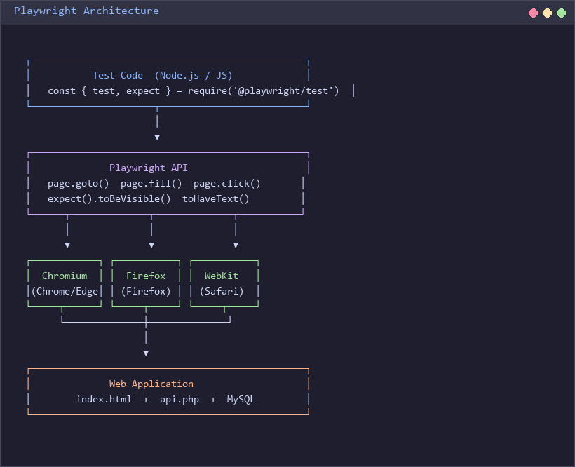
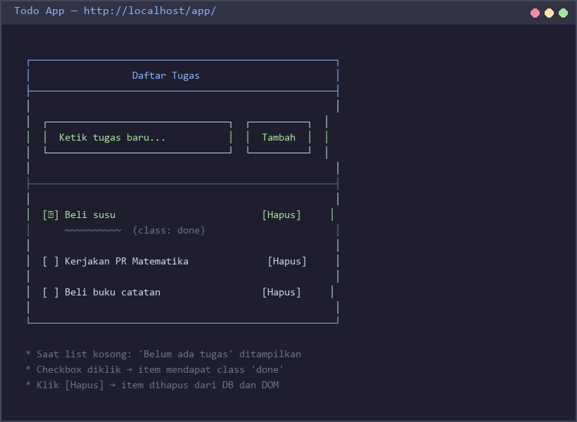
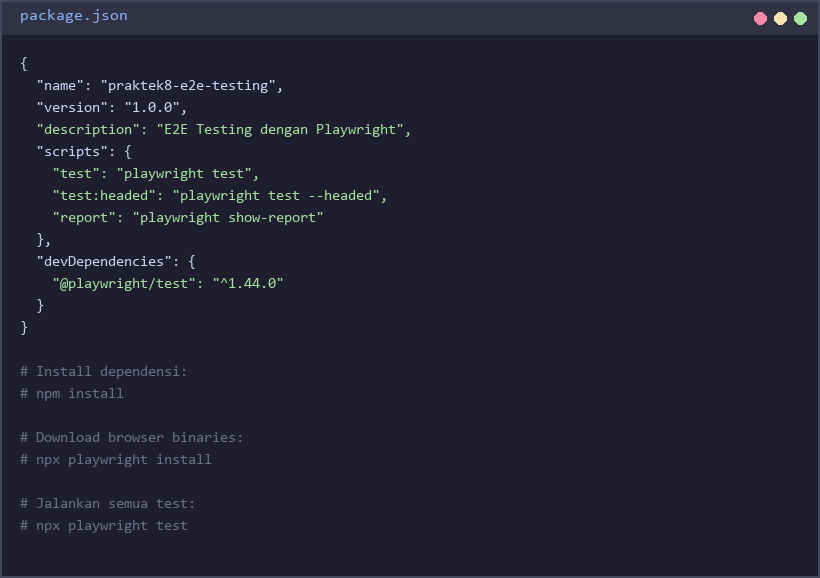
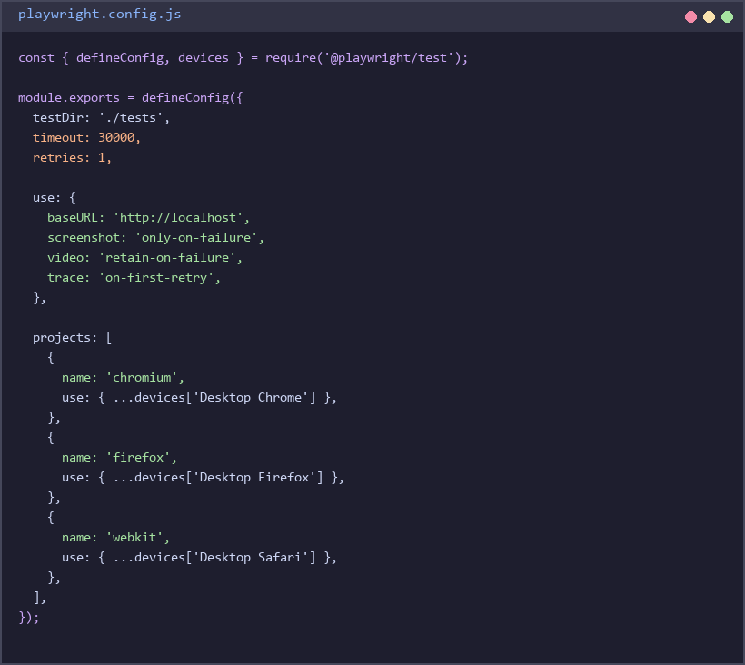
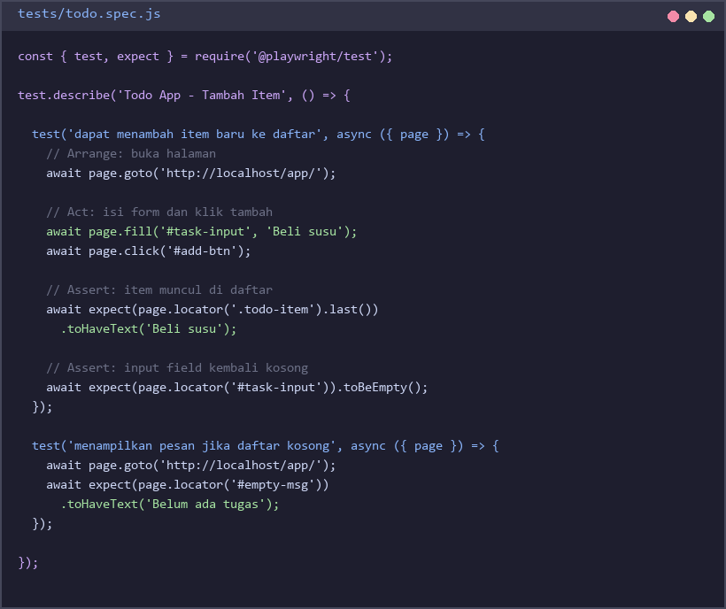
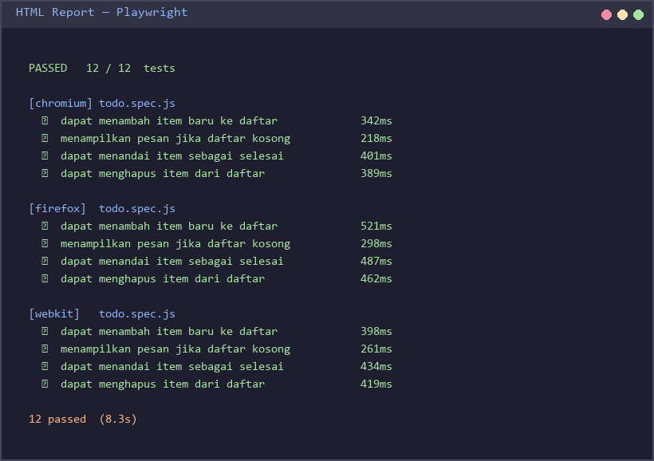
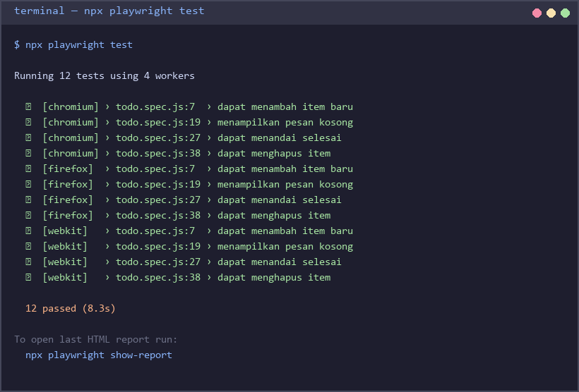

# Praktek 8 — End-to-End Testing dengan Playwright

## Tujuan Pembelajaran

Setelah menyelesaikan praktek ini, mahasiswa mampu:
- Memahami konsep **End-to-End (E2E) testing** dan perbedaannya dengan unit test dan integration test
- Menggunakan **Playwright** untuk mengotomasi interaksi browser secara nyata
- Menulis test yang mensimulasikan **alur pengguna** (user flow) dari awal hingga akhir
- Menjalankan E2E test pada **tiga browser** berbeda (Chromium, Firefox, WebKit)
- Mengidentifikasi kapan harus menggunakan E2E test vs unit test atau API test

---

## Latar Belakang

### Apa itu End-to-End Testing?

E2E testing menguji aplikasi **dari sudut pandang pengguna**. Berbeda dengan unit test yang menguji satu fungsi secara terisolasi, E2E test membuka browser sungguhan, mengklik tombol, mengisi form, dan memverifikasi hasilnya — persis seperti yang dilakukan pengguna nyata.

Contoh skenario E2E:
> *"Pengguna membuka halaman todo, mengetik 'Beli susu', menekan tombol Tambah, dan melihat item baru muncul di daftar."*

### Testing Pyramid

```
        ┌───────────┐
        │   E2E     │  ← Sedikit, lambat, tapi paling realistis
        ├───────────┤
        │    API    │  ← Sedang, menguji kontrak endpoint
        ├───────────┤
        │Integration│  ← Menguji kombinasi komponen
        ├───────────┤
        │   Unit    │  ← Banyak, cepat, terisolasi
        └───────────┘
```

**Prinsip Testing Pyramid:**
- **Unit test** membentuk fondasi — jumlah terbanyak, paling cepat, paling murah
- **E2E test** berada di puncak — jumlah paling sedikit, paling lambat, paling mahal
- E2E test tetap **paling penting** karena membuktikan bahwa keseluruhan sistem bekerja dari perspektif pengguna
- Jangan menggantikan unit test dengan E2E test — keduanya saling melengkapi

### Mengapa Playwright, Bukan Selenium?

| Fitur | Playwright | Selenium |
|-------|------------|----------|
| Auto-wait | Ya (otomatis tunggu elemen siap) | Tidak (perlu explicit wait) |
| Multi-browser | Chromium, Firefox, WebKit built-in | Butuh driver terpisah |
| Kecepatan | Lebih cepat | Lebih lambat |
| Instalasi | Satu perintah (`npm init playwright`) | Konfigurasi kompleks |
| Harga | Gratis, open-source | Gratis, open-source |
| Standard industri | Semakin dominan (2021-sekarang) | Legacy, masih dipakai |
| Screenshot/Video | Built-in | Butuh plugin |

**Playwright** dipilih karena modern, mudah disetup, dan menjadi standar industri saat ini.

### Kapan Menggunakan E2E vs API Test?

| Kondisi | Gunakan E2E | Gunakan API Test |
|---------|-------------|------------------|
| Menguji UI dan interaksi pengguna | Ya | Tidak |
| Menguji logika bisnis backend | Tidak | Ya |
| Menguji form validation di browser | Ya | Bisa keduanya |
| Menguji alur multi-halaman | Ya | Tidak |
| Menguji response code dan JSON | Tidak | Ya |
| CI/CD cepat | Tidak ideal | Ya |

---

## Persiapan

### 1. Prasyarat

Pastikan sudah terinstall:
- **Node.js** versi 18 atau lebih baru
- **npm** (otomatis terinstall bersama Node.js)
- **PHP** >= 8.0 + MySQL (XAMPP/Laragon) untuk menjalankan aplikasi target
- Browser modern (Playwright akan mengunduh browser sendiri)

Cek versi Node.js:
```bash
node --version   # harus >= v18.0.0
npm --version    # harus >= 8.0.0
```

### 2. Install Node.js

Jika belum terinstall Node.js:

**Windows:**
1. Kunjungi [https://nodejs.org](https://nodejs.org)
2. Unduh versi **LTS** (Long Term Support)
3. Jalankan installer dan ikuti petunjuk
4. Buka terminal baru dan verifikasi: `node --version`

**Via Winget (Windows 11):**
```bash
winget install OpenJS.NodeJS.LTS
```

### 3. Setup Aplikasi Web Target

Pada praktek ini kita akan menguji **Aplikasi Todo sederhana** yang terdiri dari:
- Frontend HTML + JavaScript (form tambah tugas, daftar tugas)
- Backend PHP (API CRUD ke MySQL)

Aplikasi ini mewakili aplikasi web nyata yang umum ditemui di industri.

**Setup database:**
```sql
CREATE DATABASE IF NOT EXISTS todo_app CHARACTER SET utf8mb4 COLLATE utf8mb4_unicode_ci;
USE todo_app;

CREATE TABLE todos (
    id         INT AUTO_INCREMENT PRIMARY KEY,
    task       VARCHAR(255) NOT NULL,
    is_done    TINYINT(1) NOT NULL DEFAULT 0,
    created_at TIMESTAMP DEFAULT CURRENT_TIMESTAMP
);
```

### 4. Struktur Folder

```
praktek8_e2e_testing/
├── app/                        ← Aplikasi web yang akan diuji
│   ├── index.html              ← Halaman utama Todo App
│   ├── app.js                  ← Frontend JavaScript
│   └── api.php                 ← Backend PHP (CRUD ke MySQL)
├── tests/
│   ├── todo.spec.js            ← E2E test untuk fitur Todo
│   └── form.spec.js            ← E2E test untuk validasi form
├── package.json                ← Konfigurasi Node.js dan dependensi
└── playwright.config.js        ← Konfigurasi Playwright (browser, URL, dll)
```

---

## Konsep Playwright

### Fungsi Dasar

```javascript
// Struktur dasar sebuah test
const { test, expect } = require('@playwright/test');

test('nama test yang deskriptif', async ({ page }) => {
  // Arrange: buka halaman
  await page.goto('http://localhost/app/');

  // Act: lakukan aksi
  await page.fill('#task-input', 'Beli susu');
  await page.click('#add-btn');

  // Assert: verifikasi hasil
  await expect(page.locator('.todo-item').last()).toHaveText('Beli susu');
});
```

### Navigasi dan Interaksi

| Method | Kegunaan | Contoh |
|--------|----------|--------|
| `page.goto(url)` | Buka halaman | `page.goto('http://localhost/')` |
| `page.fill(selector, text)` | Isi input field | `page.fill('#email', 'user@test.com')` |
| `page.click(selector)` | Klik elemen | `page.click('button[type=submit]')` |
| `page.locator(selector)` | Pilih elemen | `page.locator('.todo-item')` |
| `page.waitForSelector()` | Tunggu elemen muncul | `page.waitForSelector('.success-msg')` |

### Assertions (Pernyataan)

| Assertion | Kegunaan |
|-----------|----------|
| `toBeVisible()` | Elemen tampak di layar |
| `toHaveText('teks')` | Elemen mengandung teks |
| `toHaveCount(n)` | Jumlah elemen sama dengan n |
| `toBeEmpty()` | Input field kosong |
| `toHaveClass('nama-class')` | Elemen memiliki CSS class |
| `not.toBeVisible()` | Elemen tidak tampak |

### Screenshots dan Video

Playwright dapat mengambil screenshot secara otomatis saat test gagal:
```javascript
// Di playwright.config.js
use: {
  screenshot: 'only-on-failure',   // screenshot saat gagal
  video: 'retain-on-failure',      // rekam video saat gagal
}
```

### Arsitektur Playwright



```
Test Code (Node.js)
      │
      ▼
  Playwright API
      │
   ┌──┴──────────────┐
   ▼                 ▼
Chromium          Firefox        WebKit
(Chrome/Edge)    (Firefox)      (Safari)
   │                 │              │
   └────────┬────────┘
            ▼
        Web App
   (index.html + api.php)
```

Playwright berkomunikasi langsung dengan browser menggunakan **Chrome DevTools Protocol (CDP)** untuk Chromium, dan protokol serupa untuk Firefox dan WebKit.

---

## Membuat Aplikasi Target

### `app/index.html` — Halaman Todo

Aplikasi Todo sederhana dengan form input dan daftar tugas:



Fitur aplikasi:
- **Tambah tugas** — form input + tombol Tambah
- **Tandai selesai** — centang checkbox, teks menjadi coret (*strikethrough*)
- **Hapus tugas** — klik tombol hapus, item hilang dari daftar
- **Pesan kosong** — tampilkan "Belum ada tugas" jika daftar kosong

### `app/api.php` — Backend PHP

Backend menggunakan PDO untuk operasi MySQL:
- `GET /api.php?action=list` — ambil semua todo
- `POST /api.php` dengan `action=add&task=...` — tambah todo baru
- `POST /api.php` dengan `action=done&id=...` — tandai selesai
- `POST /api.php` dengan `action=delete&id=...` — hapus todo

---

## Soal

### Soal 1 — Setup Playwright (20 poin)

**Langkah:**

a) Buat folder `praktek8_e2e_testing` dan masuk ke dalamnya:
```bash
mkdir praktek8_e2e_testing
cd praktek8_e2e_testing
```

b) Inisialisasi proyek Playwright:
```bash
npm init playwright@latest
```
Saat ditanya:
- *Where to put your end-to-end tests?* → `tests`
- *Add a GitHub Actions workflow?* → `n`
- *Install Playwright browsers?* → `y`

c) Verifikasi instalasi dengan menjalankan test contoh bawaan:
```bash
npx playwright test
```

d) Tampilkan isi `package.json` yang terbentuk:



e) Tampilkan isi `playwright.config.js` yang terbentuk:



**Yang dikumpulkan:** Screenshot terminal saat `npm init playwright@latest` berhasil, dan screenshot isi kedua file konfigurasi.

---

### Soal 2 — Test Alur Tambah Item (30 poin)

Buat file `tests/todo.spec.js` dan implementasikan test untuk **alur tambah item**:



```javascript
const { test, expect } = require('@playwright/test');

test.describe('Todo App - Tambah Item', () => {

  test('dapat menambah item baru ke daftar', async ({ page }) => {
    // 1. Buka halaman aplikasi
    // 2. Isi input field dengan nama tugas
    // 3. Klik tombol Tambah
    // 4. Verifikasi item baru muncul di daftar
    // 5. Verifikasi input field kembali kosong
  });

  test('menampilkan pesan jika daftar kosong', async ({ page }) => {
    // Verifikasi teks "Belum ada tugas" muncul saat list kosong
  });

});
```

**Kriteria penilaian Soal 2:**
- Test menggunakan `page.goto()`, `page.fill()`, `page.click()` dengan benar (10 poin)
- Assertion `toHaveText()` atau `toContainText()` memverifikasi item muncul (10 poin)
- Assertion memverifikasi input field kosong setelah menambah (10 poin)

---

### Soal 3 — Test Alur Lengkap CRUD (30 poin)

Lengkapi `tests/todo.spec.js` dengan test untuk **seluruh alur CRUD**:

**Test yang harus ada:**

| No | Nama Test | Langkah |
|----|-----------|---------|
| 1 | Tambah item | (dari Soal 2) |
| 2 | Tandai selesai | Klik checkbox → verifikasi teks berubah (strikethrough / class `done`) |
| 3 | Hapus item | Klik tombol hapus → verifikasi item tidak ada lagi |
| 4 | State kosong | Hapus semua item → verifikasi muncul "Belum ada tugas" |

**Petunjuk untuk test "tandai selesai":**
```javascript
test('dapat menandai item sebagai selesai', async ({ page }) => {
  // 1. Tambah item terlebih dahulu
  // 2. Klik checkbox item tersebut
  // 3. Verifikasi item memiliki class 'done' atau style line-through
  await expect(page.locator('.todo-item.done')).toHaveCount(1);
});
```

**Petunjuk untuk test "hapus item":**
```javascript
test('dapat menghapus item dari daftar', async ({ page }) => {
  // 1. Tambah item
  // 2. Klik tombol hapus pada item tersebut
  // 3. Verifikasi jumlah item berkurang
  await expect(page.locator('.todo-item')).toHaveCount(0);
});
```

**Kriteria penilaian Soal 3:**
- Test tandai selesai: berhasil + assertion class/style (10 poin)
- Test hapus item: berhasil + assertion count berkurang (10 poin)
- Test state kosong: "Belum ada tugas" muncul (10 poin)

---

### Soal 4 — Cross-Browser Testing (10 poin)

a) Edit `playwright.config.js` untuk mengaktifkan tiga browser:

```javascript
// playwright.config.js
const { defineConfig, devices } = require('@playwright/test');

module.exports = defineConfig({
  testDir: './tests',
  use: {
    baseURL: 'http://localhost',
    screenshot: 'only-on-failure',
  },
  projects: [
    {
      name: 'chromium',
      use: { ...devices['Desktop Chrome'] },
    },
    {
      name: 'firefox',
      use: { ...devices['Desktop Firefox'] },
    },
    {
      name: 'webkit',
      use: { ...devices['Desktop Safari'] },
    },
  ],
});
```

b) Jalankan test pada semua browser:
```bash
npx playwright test
```

c) Buka HTML report:
```bash
npx playwright show-report
```

d) Screenshot hasil test menunjukkan tiga browser berjalan:



**Kriteria penilaian Soal 4:**
- `playwright.config.js` memiliki tiga project browser (4 poin)
- Test berhasil dijalankan di ketiga browser (4 poin)
- Screenshot HTML report menunjukkan hasil semua browser (2 poin)

---

### Soal 5 — Refleksi (10 poin)

Jawab pertanyaan berikut dalam file `REFLEKSI.md`:

1. **Flaky Tests** — E2E test kadang *flaky* (kadang lulus, kadang gagal tanpa perubahan kode). Sebutkan dua penyebab umum flaky test pada E2E testing dan bagaimana Playwright membantu mengatasinya?

2. **Selector Strategy** — Playwright mendukung berbagai cara memilih elemen: by CSS selector (`.todo-item`), by text (`page.getByText('Tambah')`), by role (`page.getByRole('button')`), dan by `data-testid` (`page.getByTestId('add-btn')`). Mana yang **paling stabil** dan mengapa? Kapan sebaiknya menggunakan `data-testid`?

3. **E2E vs Unit Test** — Diberikan dua skenario berikut, tentukan mana yang lebih tepat menggunakan E2E test dan mana yang lebih tepat menggunakan unit test. Jelaskan alasannya:
   - Skenario A: Memvalidasi bahwa fungsi `calculateDiscount(price, percent)` mengembalikan nilai yang benar
   - Skenario B: Memvalidasi bahwa pengguna dapat menambah item, menandai selesai, lalu menghapusnya dalam satu alur

---

## Cara Menjalankan Test

```bash
# Jalankan semua test (headless, semua browser)
npx playwright test

# Jalankan dengan browser terlihat (headed mode)
npx playwright test --headed

# Jalankan hanya satu file test
npx playwright test tests/todo.spec.js

# Jalankan di browser tertentu
npx playwright test --project=firefox

# Jalankan test tertentu berdasarkan nama
npx playwright test --grep "dapat menambah"

# Buka HTML report setelah test selesai
npx playwright show-report

# Mode debug interaktif
npx playwright test --debug
```

### Contoh Output yang Diharapkan



```
Running 12 tests using 4 workers

  ✓  [chromium] › todo.spec.js:5 › Tambah Item › dapat menambah item baru ke daftar
  ✓  [chromium] › todo.spec.js:15 › Tambah Item › menampilkan pesan jika daftar kosong
  ✓  [chromium] › todo.spec.js:25 › CRUD › dapat menandai item sebagai selesai
  ✓  [chromium] › todo.spec.js:35 › CRUD › dapat menghapus item dari daftar
  ✓  [firefox]  › todo.spec.js:5 › Tambah Item › dapat menambah item baru ke daftar
  ✓  [firefox]  › todo.spec.js:15 › Tambah Item › menampilkan pesan jika daftar kosong
  ✓  [webkit]   › todo.spec.js:5 › Tambah Item › dapat menambah item baru ke daftar
  ✓  [webkit]   › todo.spec.js:15 › Tambah Item › menampilkan pesan jika daftar kosong
  ...

  12 passed (8.3s)
```

---

## Kriteria Penilaian

| Soal | Bobot | Kriteria |
|------|-------|----------|
| Soal 1 — Setup Playwright | 20 poin | Playwright terinstall, test contoh berjalan, konfigurasi benar |
| Soal 2 — Test Tambah Item | 30 poin | Navigasi, isi form, klik, assertion item muncul + input kosong |
| Soal 3 — Test CRUD Lengkap | 30 poin | Test selesai, hapus, dan state kosong — semua pass |
| Soal 4 — Cross-Browser | 10 poin | Config 3 browser, test pass di semua browser, screenshot report |
| Soal 5 — Refleksi | 10 poin | Jawaban tepat tentang flaky test, selector, dan kapan pakai E2E |

**Total: 100 poin**
